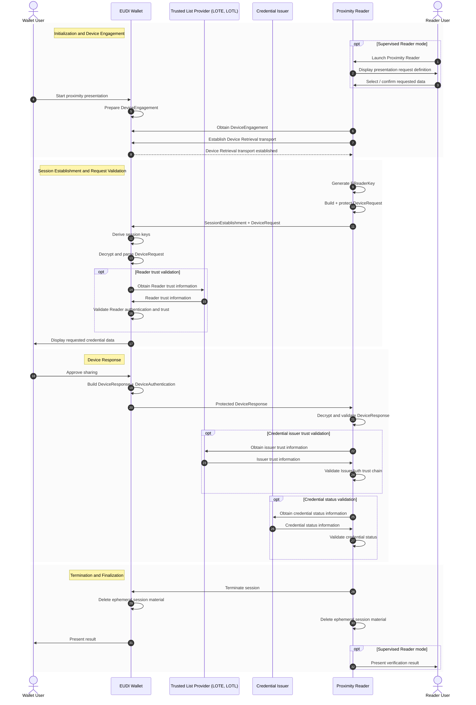

# **APTITUDE RFC-05 Proximity Presentation Profile**

**Status:** Draft

**Type:** Cross-pilot baseline RFC

**Scope:** Credential Proximity Presentation / Verification

**Target protocols:** ISO/IEC 18013-5

**Proximity Presentation profiles:**

* **Device Engagement:** QR Code, NFC
* **Device Retrieval:** BLE, NFC

## **Authors**

* Tomasz Sikorski, COI

## **Reviewers**

## **1\. Introduction**

This document defines the **APTITUDE Proximity Presentation Profile** for interoperable credential presentation and verification in proximity scenarios across APTITUDE pilots.

It specifies a baseline, cross-pilot profile for the proximity presentation and verification of `mso_mdoc` attestations, aligned with the Architecture and Reference Framework (ARF) and based on **ISO/IEC 18013-5** device engagement and proximity data retrieval. Where applicable, the profile incorporates relevant requirements from the **ETSI TS 119 472-2 ISO/IEC-mdoc presentation profile**.

The purpose of this RFC is to establish a stable starting point for interoperability across APTITUDE pilots by defining:

* common proximity presentation and verification requirements
* roles and interfaces between Wallets and proximity Readers
* baseline device engagement and proximity transport requirements
* secure session establishment and encrypted data exchange
* request and response processing for `mso_mdoc` attestations
* user consent and selective disclosure requirements
* device authentication and holder-binding requirements
* Reader authentication and trust validation requirements, where applicable
* baseline security and privacy expectations for proximity presentation
* a requirements baseline that can be mapped into corresponding **ITB+ conformance test cases**

This RFC is intended to support interoperability first. Credential-specific, sector-specific, or pilot-specific extensions may be added separately, but they should not weaken the baseline proximity presentation requirements defined here.

---

## **2. Scope**

This RFC defines the conformance profile for **proximity credential presentation and verification** in APTITUDE.

It covers requirements for:

* **<components:Wallet Unit|Wallet Units> / Wallets** acting on behalf of the [roles:User](roles:User)
* **<roles:Relying Party (RP)|Relying Parties>**, through a proximity **Reader**, requesting and validating credential presentations
* an optional **Reader User**, operating the Reader on behalf of the Relying Party in supervised proximity presentation scenarios

A proximity Reader may operate in either a **supervised** or **unsupervised** mode.

In supervised mode, the Reader is operated by a natural person acting on behalf of the Relying Party. In unsupervised mode, the Reader operates as an unattended device or automated system without active involvement of a Reader User. Both operating modes are within the scope of this RFC and SHALL use the same baseline proximity presentation protocol defined herein.

This profile defines a baseline for interoperable proximity presentation using **ISO/IEC 18013-5** device engagement, session establishment, and device retrieval mechanisms.

The baseline credential format for this profile is **ISO mdoc (`mso_mdoc`)**. Credential-specific document types, namespaces, data elements, and semantic validation rules are determined by the applicable attestation Rulebook or data model and are not defined by this RFC.

This RFC includes baseline requirements for:

* device engagement and establishment of a proximity interaction between the Wallet and Reader
* QR Code-based device engagement
* Bluetooth Low Energy (BLE) communication for proximity device retrieval
* optional Near Field Communication (NFC) for device engagement
* optional Near Field Communication (NFC) for proximity device retrieval
* establishment and protection of an encrypted ISO/IEC 18013-5 session
* construction, transmission, and processing of `DeviceRequest` and `DeviceResponse`
* presentation of one or more `mso_mdoc` attestations within a single proximity session
* explicit user consent before disclosure of requested credential data
* selective disclosure of requested data elements
* cryptographic binding of the presentation to the active proximity session
* mdoc device authentication using MAC Authentication and, where applicable, mdoc ECDSA / EdDSA Authentication
* Reader authentication and Reader identity processing, where applicable
* validation of credential authenticity and issuer trust
* credential status validation, where applicable
* secure session termination and disposal of ephemeral session key material
* baseline privacy and security requirements applicable to proximity presentation

The baseline proximity interaction defined by this RFC uses:

* **QR Code** for device engagement
* **Bluetooth Low Energy (BLE)** for device retrieval
* Wallet operation in **BLE Peripheral Server mode**
* Reader operation in **BLE Central Client mode**
* **GATT** as the baseline BLE communication profile

The following capabilities are supported as optional extensions to the baseline profile:

* **NFC-based device engagement**
* **NFC-based device retrieval**
* Wallet operation in **BLE Central Client mode**
* Reader operation in **BLE Peripheral Server mode**
* BLE **L2CAP Connection-Oriented Channels (CoC)**

Where NFC device retrieval is supported, the Wallet and Reader MAY use **NFC as the device retrieval transport instead of BLE**, in accordance with ISO/IEC 18013-5.

Device engagement and device retrieval transport are treated as separate aspects of the proximity interaction. Support for NFC-based device engagement therefore does not imply that NFC-based device retrieval is used. Likewise, implementations supporting NFC-based device retrieval SHALL follow the applicable ISO/IEC 18013-5 mechanisms independently of the device engagement method used to initiate the proximity interaction.

Where applicable, implementations SHALL also apply the relevant requirements of the **ETSI TS 119 472-2 ISO/IEC-mdoc presentation profile**, including requirements related to:

* Reader/verifier identification
* Reader authentication
* trust validation
* encrypted session handling
* holder binding
* credential status validation

This RFC does **not** define:

* sector-specific credential semantics, document types, namespaces, or data elements
* credential issuance or credential lifecycle management protocols
* credential-specific business rules or validation decisions
* business processes performed before or after the proximity presentation
* governance rules of the applicable trust framework
* organizational rules for issuing Reader, registration, access, or credential issuer certificates
* pilot-specific or sector-specific user-interface requirements
* business-specific behavior of supervised or unsupervised Readers
* detailed conformance test assertions; these are derived into the ITB+ test suite from the requirements matrix defined in this document

Where this RFC defines mechanisms for Reader authentication, issuer authentication, trust validation, or credential status verification, these mechanisms are included solely to support interoperable and secure proximity presentation and verification. They do not by themselves define the governance, authorization model, or legal effect of the corresponding trust framework.

---

## **3\. Normative Language**

The key words **SHALL**, **SHALL NOT**, **SHOULD**, **SHOULD NOT**, **MAY**, and **OPTIONAL** in this document are to be interpreted as described in RFC 2119 and RFC 8174.

---

## **4. Roles and Components**

This RFC uses the following roles and components.

### **4.1 User**

The **[roles:User](roles:User)**, as defined in the APTITUDE glossary, is the natural person or legal representative controlling the Wallet and authorising the proximity presentation of credentials.

The User reviews the data requested by the proximity Reader and explicitly authorises disclosure before credential data is released by the Wallet.

### **4.2 Wallet Unit / Wallet**

The **Wallet Unit** is the <components:Wallet Unit> as defined in the ARF and APTITUDE glossary, including one or more <components:Wallet Instance|Wallet Instances> on the Holder’s device or environment.

In this RFC, the term **Wallet** refers to the Wallet Unit, and its Wallet Instances where the distinction is not material, acting on behalf of the [roles:User](roles:User) to manage credentials and perform proximity presentation using ISO/IEC 18013-5.

The Wallet participates in device engagement, establishes the secure proximity session with the Reader, processes the `DeviceRequest`, obtains User consent, and generates and transmits the corresponding `DeviceResponse`.

### **4.3 Relying Party**

The **<roles:Relying Party (RP)|Relying Party>**, as defined in the APTITUDE glossary, is the entity requesting credential data through a proximity Reader, validating the received presentation, and making an authorisation or business decision based on the verification outcome.

The business purpose for which the credential data is requested is outside the scope of this RFC.

### **4.4 Proximity Reader**

The **Proximity Reader** is the <components:Relying Party Instance> that interacts locally with the Wallet using the proximity presentation mechanisms defined by this RFC.

The Proximity Reader performs the Reader-side functions of the ISO/IEC 18013-5 proximity presentation protocol, including, as applicable:

* device engagement processing
* establishment of the proximity communication channel
* generation and transmission of the `DeviceRequest`
* establishment of the encrypted session
* receipt and processing of the `DeviceResponse`
* validation of mdoc issuer authentication and device authentication
* validation of the presentation against the active session context
* Reader authentication and provision of Reader identity information
* trust and credential status validation, where applicable
* secure termination of the proximity session

A Proximity Reader may be implemented as software, hardware, or a combination thereof.

A Proximity Reader may operate in either **supervised** or **unsupervised** mode. The operating mode does not change the baseline ISO/IEC 18013-5 proximity presentation protocol defined by this RFC.

### **4.5 Relying Party Backend**

The **<components:Verifier Backend|Relying Party Backend>**, as defined in the APTITUDE glossary, is an optional server-side component supporting the Proximity Reader.

Where used, the Relying Party Backend MAY perform functions such as:

* definition or preparation of credential data requests
* validation of received credential data
* issuer trust validation
* Reader trust or registration-related processing
* credential status validation
* application-specific processing of the verification result

The use of a Relying Party Backend is not required by this RFC. A Proximity Reader MAY perform the required proximity presentation and verification functions locally without relying on a continuously connected backend.

The interface between the Proximity Reader and the Relying Party Backend is outside the scope of this RFC.

### **4.6 Reader User**

The **Reader User** is an optional natural person operating the Proximity Reader on behalf of the Relying Party.

The Reader User is present in **supervised** proximity presentation scenarios and may initiate the verification process, select or confirm the requested credential data, and receive the verification result through the Reader interface.

In **unsupervised** scenarios, no Reader User is involved and the Proximity Reader operates as an unattended or automated system.

The presence or absence of a Reader User does not alter the Wallet-to-Reader protocol requirements defined by this RFC.

## **5. Protocol Overview**

The APTITUDE Proximity Presentation Profile is based on **ISO/IEC 18013-5** as the baseline protocol for proximity presentation and verification of ISO mdoc (`mso_mdoc`) attestations.

The profile covers device engagement, establishment of a proximity communication channel, secure session establishment, credential data request and response processing, device authentication, selective disclosure, and verification of the resulting mdoc presentation.

This RFC defines a **baseline APTITUDE proximity presentation mode** intended to provide interoperable Wallet-to-Reader communication across APTITUDE pilots. Where applicable, it applies the relevant requirements of the **ETSI TS 119 472-2 ISO/IEC-mdoc presentation profile**.

### **5.1 Baseline APTITUDE proximity presentation mode**

In the baseline mode:

* the Wallet initiates device engagement and makes the required `DeviceEngagement` information available to the Reader
* device engagement is performed using a QR Code
* the Reader establishes a proximity communication channel with the Wallet using Bluetooth Low Energy (BLE)
* the Wallet operates as a BLE Peripheral Server and the Reader operates as a BLE Central Client
* the Reader and Wallet establish an encrypted ISO/IEC 18013-5 session using ephemeral session key material
* the Reader creates and sends a `DeviceRequest` identifying the credential documents and data elements requested for presentation
* the Wallet validates and processes the request before presenting the requested data to the [roles:User](roles:User)
* the [roles:User](roles:User) reviews the requested disclosure and explicitly approves release of credential data
* the Wallet creates a `DeviceResponse` containing one or more requested `mso_mdoc` attestations and the corresponding cryptographic authentication material
* the Wallet encrypts and transmits the `DeviceResponse` within the established ISO/IEC 18013-5 session
* the Reader decrypts and validates the received response, including issuer authentication, device authentication, session binding, and other applicable trust and status checks
* the Wallet and Reader securely terminate the session and dispose of ephemeral session key material after completion

The baseline proximity mode requires interoperability at protocol level and does **not** depend on a particular business use case, credential type, or Reader deployment model.

### **5.2 ETSI-aligned requirements**

For proximity presentation flows in scope for this RFC, the exchange SHALL apply the relevant requirements of the **ETSI TS 119 472-2 ISO/IEC-mdoc presentation profile**, where applicable.

These requirements include:

* identification of the Reader / Relying Party
* Reader authentication, where required by the applicable deployment and trust model
* processing and validation of Reader authentication and trust information
* integrity protection of the Reader request
* establishment and use of an encrypted ISO/IEC 18013-5 session
* cryptographic binding of the `DeviceResponse` to the active session
* issuer authentication of presented mdoc attestations
* device authentication of presented mdoc attestations
* validation of credential status information, where applicable

Where Reader registration certificates, Reader access certificates, trusted lists, or equivalent trust information are used, their processing SHALL follow the applicable ETSI profile and trust framework requirements.

This RFC profiles their use within the proximity presentation exchange but does **not** define the governance, issuance, or legal effect of the corresponding certificates or trust infrastructure.

### **5.3 Supported proximity interaction patterns**

The mandatory interoperability baseline defined by this RFC is **QR Code Device Engagement → BLE Device Retrieval**, using:

* Wallet as **BLE Peripheral Server**
* Reader as **BLE Central Client**
* **GATT** as the baseline BLE communication profile

The following additional proximity capabilities are optional:

* **NFC Device Engagement**
* **NFC Device Retrieval**
* Wallet operation as a **BLE Central Client**
* Reader operation as a **BLE Peripheral Server**
* BLE **L2CAP Connection-Oriented Channels (CoC)**

Where NFC Device Retrieval is supported, NFC MAY be used instead of BLE for the device retrieval phase in accordance with ISO/IEC 18013-5.

Device Engagement and Device Retrieval are independent protocol aspects. The Device Engagement mechanism communicates the information required to establish the subsequent proximity interaction, including the supported connection method or methods. The selected Device Retrieval transport is then used for the secure exchange of the `DeviceRequest` and `DeviceResponse`.

The Proximity Reader may operate in either:

* **supervised mode**, where a Reader User operates the Reader; or
* **unsupervised mode**, where the Reader operates as an unattended or automated system.

Both operating modes use the same Wallet-to-Reader proximity protocol defined by this RFC.

### **5.4 High-level proximity presentation sequence**

At a high level, the proximity presentation process is:

1. The Wallet prepares ephemeral device engagement key material and creates `DeviceEngagement`.
2. The Reader obtains the `DeviceEngagement` information using a supported Device Engagement mechanism.
3. The Wallet and Reader establish the selected Device Retrieval communication channel.
4. The Reader generates ephemeral reader key material and the Wallet and Reader establish the ISO/IEC 18013-5 session context and session encryption keys.
5. The Reader constructs a `DeviceRequest` containing the requested document types, namespaces, and data elements.
6. The Reader transmits the encrypted `DeviceRequest` to the Wallet within the established session.
7. The Wallet decrypts and validates the request and performs applicable Reader authentication and trust validation.
8. The Wallet presents the requested disclosure to the [roles:User](roles:User) and obtains explicit consent.
9. The Wallet creates a `DeviceResponse`, including issuer authentication and device authentication, and transmits the encrypted response to the Reader.
10. The Reader decrypts and validates the `DeviceResponse`, including credential authenticity, device authentication, session binding, trust, and credential status where applicable.
11. The Wallet and Reader terminate the proximity session and securely dispose of ephemeral session key material.

### **5.5 mdoc device authentication**

The Wallet SHALL provide mdoc device authentication for every presented mdoc in accordance with ISO/IEC 18013-5.

The Wallet **SHOULD use MAC Authentication** for mdoc device authentication where technically feasible.

Where MAC Authentication is not technically feasible in the applicable implementation context, the Wallet **MAY use mdoc ECDSA / EdDSA Authentication**.

A conforming Proximity Reader **SHALL support validation of both**:

* MAC Authentication; and
* mdoc ECDSA / EdDSA Authentication.

The authentication result SHALL be cryptographically bound to the active ISO/IEC 18013-5 session and the corresponding `SessionTranscript`.

### **5.6 Relation to ETSI-aligned proximity presentation profiling**

ETSI TS 119 472-2 defines an **ISO/IEC-mdoc presentation profile** for proximity-based, non-API-mediated device retrieval based on ISO/IEC 18013-5.

This RFC adopts that proximity presentation model as the basis for the APTITUDE proximity interoperability profile and adds APTITUDE-specific baseline choices where a common implementation baseline is required.

In particular, this RFC defines common APTITUDE expectations for:

* supported Device Engagement mechanisms
* supported Device Retrieval transports
* BLE operating roles
* processing of `DeviceRequest` and `DeviceResponse`
* user consent and selective disclosure
* mdoc device authentication
* Reader authentication and trust validation
* secure session establishment and termination
* handling of one or more mdoc attestations within a single proximity session

Credential-specific document types, namespaces, data elements, disclosure policies, and validation rules remain defined by the applicable credential Rulebook and are outside the scope of this horizontal RFC.

## **6. High-Level Flows**

This section defines the high-level proximity presentation flows supported by this RFC.

The mandatory APTITUDE interoperability baseline is **QR Code Device Engagement → BLE Device Retrieval**.

Implementations MAY additionally support:

* **NFC Device Engagement → NFC Device Retrieval**
* **NFC Device Engagement → BLE Device Retrieval**
* **QR Code Device Engagement → NFC Device Retrieval**

The Device Engagement mechanism and the Device Retrieval transport are separate aspects of the ISO/IEC 18013-5 proximity presentation flow.

Unless explicitly stated otherwise, the same requirements for request processing, User consent, selective disclosure, mdoc authentication, response validation, trust processing, and session termination apply independently of the Device Engagement and Device Retrieval mechanisms selected for a particular proximity interaction.

The high-level relationship between the participants is:

The Reader User is optional and is present only in supervised Reader deployments.

---

### **6.1 QR Code Device Engagement with BLE Device Retrieval**

This flow defines the mandatory proximity interoperability baseline of this RFC.

The Wallet performs Device Engagement using a QR Code and advertises BLE as an available Device Retrieval method. The Reader obtains the Device Engagement information by scanning the QR Code and subsequently establishes a BLE connection with the Wallet.

#### **Sequence diagram**

```mermaid
sequenceDiagram
    autonumber

    Actor U as Wallet User
    participant Wallet as EUDI Wallet (Peripheral, GATT Server)
    participant Reader as Proximity Reader (Central, GATT Client)
    Actor RU as Reader User

    rect rgba(230, 230, 230, 0.18)
        Note left of Wallet: Initialization

        opt Supervised Reader mode
            RU->>Reader: Launch Proximity Reader
            Reader->>RU: Display presentation request definition
            RU->>Reader: Select / confirm requested data
        end

        Reader->>Reader: Prepare DeviceRequest
        Reader->>Reader: Enable QR Code scanner

        U->>Wallet: Start proximity presentation
        Wallet->>Wallet: Prepare EDeviceKey + BLE ConnectionMethod
        Wallet->>Wallet: Render DeviceEngagement QR Code
    end

    rect rgba(230, 230, 230, 0.18)
        Note left of Wallet: Device Engagement

        Reader->>Wallet: Scan QR Code
        Wallet->>Reader: DeviceEngagement (CBOR)
        Reader->>Reader: Process DeviceEngagement
        Reader->>Reader: Build SessionTranscript base
        Reader->>Reader: Scan for BLE mdoc service
        Reader->>Wallet: BLE Connect
        Wallet->>Reader: BLE connection established

        opt Ident characteristic used
            Reader->>Wallet: Read Ident = SHA-256(EDeviceKeyBytes)
        end

        Reader->>Wallet: Enable required notifications
    end

    rect rgba(230, 230, 230, 0.18)
        Note left of Wallet: Session Establishment and Device Request

        Reader->>Wallet: Write State = Start
        Reader->>Reader: Generate EReaderKey
        Reader->>Reader: Derive session keys
        Reader->>Reader: Build + encrypt DeviceRequest

        loop Fragmented message
            Reader->>Wallet: SessionEstablishment + encrypted DeviceRequest (more data)
        end

        Reader->>Wallet: SessionEstablishment + encrypted DeviceRequest (last fragment)

        Wallet->>Wallet: Derive session keys
        Wallet->>Wallet: Build SessionTranscript
        Wallet->>Wallet: Decrypt and parse DeviceRequest

        opt Reader authentication / trust validation
            Wallet->>Wallet: Validate ReaderAuth and Reader trust
        end

        Wallet->>U: Display requested credential data
    end

    rect rgba(230, 230, 230, 0.18)
        Note left of Wallet: User Consent and Device Response

        U->>Wallet: Approve sharing
        Wallet->>Wallet: Build DeviceResponse + DeviceAuthentication

        alt MAC Authentication
            Wallet->>Wallet: Perform ECKA-DH
            Wallet->>Wallet: Derive EMacKey using HKDF
            Wallet->>Wallet: Calculate MAC
            Wallet->>Wallet: Add deviceMac to DeviceAuth
        else mdoc ECDSA / EdDSA Authentication
            Wallet->>Wallet: Sign DeviceAuthentication
            Wallet->>Wallet: Add deviceSignature to DeviceAuth
        end

        Wallet->>Wallet: Encrypt DeviceResponse

        loop Fragmented message
            Wallet-->>Reader: Encrypted DeviceResponse (more data)
        end

        Wallet-->>Reader: Encrypted DeviceResponse (last fragment)

        Reader->>Reader: Decrypt DeviceResponse
        Reader->>Reader: Validate IssuerAuth
        Reader->>Reader: Validate DeviceAuthentication
        Reader->>Reader: Validate SessionTranscript binding
    end

    rect rgba(230, 230, 230, 0.18)
        Note left of Wallet: Session Termination

        alt End Command
            Reader->>Wallet: Write State = End
        else Session Termination
            Reader->>Wallet: SessionData (statusCode=20)
        end

        Wallet->>Wallet: Delete EDeviceKey and session keys
        Reader->>Reader: Delete EReaderKey and session keys
        Wallet->>Wallet: Close communication channel
        Reader->>Reader: Close communication channel
    end

    rect rgba(230, 230, 230, 0.18)
        Note left of Wallet: Finalization

        Wallet->>U: Present result

        opt Supervised Reader mode
            Reader->>RU: Present verification result
        end
    end
```

#### **6.1.1 Presentation Request Preparation**

Before initiating Device Retrieval, the Proximity Reader SHALL determine the credential information that it intends to request from the Wallet.

The request definition SHOULD identify, as applicable:

* requested mdoc document type or types
* requested namespaces
* requested data elements
* intent to retain information, where applicable
* additional request information required by the applicable credential Rulebook or presentation profile

In a **supervised** Reader deployment, the Reader User MAY select or confirm the requested credential data before the proximity interaction begins.

In an **unsupervised** Reader deployment, the request MAY be predefined or dynamically determined by the Relying Party system without involvement of a Reader User.

The operating mode of the Reader SHALL NOT change the Wallet-to-Reader protocol defined by this RFC.

#### **6.1.2 Wallet Initialization and Device Engagement**

The [roles:User](roles:User) initiates the proximity presentation function of the Wallet.

The Wallet SHALL prepare the ISO/IEC 18013-5 Device Engagement information required to establish and secure the subsequent Device Retrieval session.

This includes, as applicable:

* ephemeral device engagement key material (`EDeviceKey`)
* supported cipher suite information
* supported Device Retrieval connection information
* additional Device Engagement information required by ISO/IEC 18013-5

For the baseline flow, the Wallet SHALL include the BLE ConnectionMethod information required to establish the subsequent BLE communication channel.

The Wallet SHALL encode the `DeviceEngagement` structure according to ISO/IEC 18013-5 and make it available to the Reader through a QR Code.

The Reader SHALL scan and process the QR Code before establishing the Device Retrieval connection.

The ephemeral device engagement private key SHALL be generated for the proximity interaction and SHALL NOT be reused across independent presentation sessions.

#### **6.1.3 BLE Connection Establishment**

After processing `DeviceEngagement`, the Reader SHALL establish the BLE Device Retrieval connection using the connection information provided by the Wallet.

For the mandatory baseline:

* the Wallet SHALL operate as a **BLE Peripheral Server**
* the Reader SHALL operate as a **BLE Central Client**
* the Reader SHALL discover and connect to the Wallet's mdoc BLE service
* **GATT** SHALL be supported as the baseline BLE communication profile

The Wallet and Reader SHALL perform the BLE state and characteristic operations required by ISO/IEC 18013-5 before exchanging protected Device Retrieval messages.

The Wallet MAY additionally support BLE Central Client mode and the Reader MAY support BLE Peripheral Server mode.

Where both parties support BLE L2CAP Connection-Oriented Channels (CoC), L2CAP MAY be used as an alternative supported BLE communication mechanism in accordance with the applicable ISO/IEC 18013-5 requirements.

#### **6.1.4 Session Establishment and Device Request**

The Reader SHALL generate ephemeral reader key material (`EReaderKey`) for the active proximity session.

The Wallet and Reader SHALL establish the ISO/IEC 18013-5 session context and derive the corresponding session encryption keys using the key agreement and key derivation mechanisms defined by ISO/IEC 18013-5.

The `SessionTranscript` SHALL cryptographically bind the presentation to the active proximity session.

The Reader SHALL construct a `DeviceRequest` containing one or more document requests.

Each document request SHALL identify, as applicable:

* requested document type
* requested namespaces
* requested data elements
* intent to retain information
* additional request information defined by the applicable credential profile

Where Reader Authentication is applicable, the Reader SHALL provide the corresponding Reader Authentication information in accordance with ISO/IEC 18013-5 and the applicable ETSI presentation profile requirements.

The Reader SHALL transmit the `DeviceRequest` using the protected ISO/IEC 18013-5 session.

No credential data SHALL be transmitted by the Wallet before the secure session has been successfully established.

#### **6.1.5 Wallet Request Validation**

The Wallet SHALL decrypt and validate the received `DeviceRequest` before presenting the request to the [roles:User](roles:User).

Validation SHALL include, as applicable:

* validity and structure of the `DeviceRequest`
* supported document types
* supported namespaces and data elements
* compatibility with credentials available in the Wallet
* integrity of the active session
* `SessionTranscript` binding
* Reader Authentication
* Reader identity and trust information
* Reader authorisation to request the specified data, where such authorisation information is available

Where Reader registration certificates, Reader access certificates, trusted lists, or equivalent trust information are used, the Wallet SHALL process them according to the applicable ETSI profile and trust framework requirements.

Invalid, malformed, unsupported, or unauthorised requests SHALL NOT result in disclosure of credential data.

#### **6.1.6 Holder Consent**

After successful request processing, the Wallet SHALL present the requested disclosure to the [roles:User](roles:User) in a transparent and understandable manner.

The Wallet SHOULD display, where applicable:

* identity of the Relying Party / Reader
* purpose or context of the request
* requested credential or credentials
* requested data elements
* mandatory or optional nature of requested data elements, where this information is available
* retention information, where provided

The [roles:User](roles:User) SHALL explicitly approve the release of credential data before the Wallet generates the corresponding `DeviceResponse`.

The Wallet SHALL support selective disclosure and SHALL disclose only data elements that:

* were requested by the Reader
* are available in the selected credential
* were authorised for disclosure by the [roles:User](roles:User)

The [roles:User](roles:User) SHALL be able to cancel the proximity presentation before credential data is disclosed.

#### **6.1.7 Device Response Generation and Transmission**

After User consent, the Wallet SHALL construct an ISO/IEC 18013-5 `DeviceResponse`.

The `DeviceResponse` MAY contain one or more mdoc documents within the same proximity session.

For each presented mdoc, the Wallet SHALL provide:

* requested issuer-signed data elements
* applicable issuer authentication information
* applicable device-signed data
* mdoc device authentication bound to the active `SessionTranscript`

For mdoc device authentication, the Wallet **SHOULD use MAC Authentication** where technically feasible.

Where MAC Authentication is not technically feasible, the Wallet **MAY use mdoc ECDSA / EdDSA Authentication**.

The Wallet SHALL protect and transmit the `DeviceResponse` within the active ISO/IEC 18013-5 session.

Where the selected Device Retrieval transport requires message fragmentation, the Wallet and Reader SHALL perform fragmentation and reassembly according to the applicable ISO/IEC 18013-5 transport requirements.

#### **6.1.8 Reader Validation and Result Handling**

The Reader SHALL decrypt and validate the received `DeviceResponse`.

Validation SHALL include, as applicable:

* successful session decryption
* consistency of the response with the active `SessionTranscript`
* consistency with the original `DeviceRequest`
* document type consistency
* namespace and data element consistency
* issuer authentication
* validation of issuer-signed data element digests
* mdoc device authentication
* validation of MAC Authentication or mdoc ECDSA / EdDSA Authentication, as applicable
* issuer trust validation
* credential validity
* credential status validation, where applicable

A conforming Proximity Reader SHALL support validation of both:

* **MAC Authentication**
* **mdoc ECDSA / EdDSA Authentication**

Trust and status validation MAY be performed locally by the Reader or with support from an optional Relying Party Backend or external trust/status infrastructure.

The core ISO/IEC 18013-5 Device Retrieval exchange SHALL NOT depend on continuous network connectivity between the Reader and an external backend.

The resulting verification outcome SHOULD clearly distinguish, as applicable:

* successful verification
* verification failure
* User cancellation
* unsupported request or credential
* Reader authentication or trust failure
* credential authentication failure
* credential status failure
* protocol or transport failure

In supervised mode, the result MAY be presented to the Reader User.

In unsupervised mode, the result MAY be consumed directly by the automated Relying Party system.

The Wallet SHOULD provide the [roles:User](roles:User) with an understandable indication that the proximity presentation has completed or failed.

#### **6.1.9 Session Termination**

After completion, cancellation, or failure of the proximity presentation, the Wallet and Reader SHALL terminate the active Device Retrieval session according to ISO/IEC 18013-5.

Session termination MAY use the applicable ISO/IEC 18013-5 session termination mechanism or transport-specific termination mechanism.

After termination:

* the Wallet SHALL dispose of the `EDeviceKey` private key material associated with the completed session
* the Reader SHALL dispose of the `EReaderKey` private key material associated with the completed session
* both parties SHALL dispose of derived session encryption keys
* the Device Retrieval communication channel SHALL be closed
* ephemeral session key material SHALL NOT be reused for a subsequent independent presentation session

---

### **6.2 Extended Trust and Credential Status Validation**

Trust establishment and credential status processing may require additional infrastructure outside the direct Wallet-to-Reader proximity channel.

The following diagram illustrates an extended proximity presentation flow in which the Wallet performs Reader trust validation and the Reader performs credential issuer trust and status validation.

These interactions are logical and MAY be performed using locally cached trust material instead of online requests during the proximity transaction.

#### **Extended sequence diagram**

The mechanisms used to distribute, cache, refresh, or obtain trust and credential status information are outside the direct ISO/IEC 18013-5 Device Retrieval exchange.

Where such mechanisms are used, implementations SHALL apply the requirements of the applicable trust framework, ETSI profile, credential Rulebook, and status mechanism.

Absence of continuous network connectivity SHALL NOT by itself prevent execution of the core proximity presentation protocol where the required trust and validation information is otherwise available locally.

---

### **6.3 NFC Device Engagement with NFC Device Retrieval**

This flow defines the optional **NFC-to-NFC** proximity presentation mode.

Both Device Engagement and subsequent Device Retrieval are performed using NFC.

The logical request, consent, authentication, response generation, and validation processing remains equivalent to the baseline flow defined in Section 6.1. The main difference is the Device Engagement and Device Retrieval transport.

#### **Sequence diagram**

```mermaid
sequenceDiagram
    autonumber

    Actor U as Wallet User
    participant Wallet as EUDI Wallet (NFC)
    participant Reader as Proximity Reader (NFC)
    Actor RU as Reader User

    rect rgba(230, 230, 230, 0.18)
        Note left of Wallet: Initialization

        opt Supervised Reader mode
            RU->>Reader: Launch Proximity Reader
            Reader->>RU: Display presentation request definition
            RU->>Reader: Select / confirm requested data
        end

        Reader->>Reader: Prepare DeviceRequest

        U->>Wallet: Start proximity presentation
        Wallet->>Wallet: Prepare EDeviceKey
        Wallet->>Wallet: Prepare NFC Device Engagement
        Wallet->>Wallet: Advertise / enable NFC Device Retrieval capability
    end

    rect rgba(230, 230, 230, 0.18)
        Note left of Wallet: NFC Device Engagement

        U->>Reader: Bring Wallet device into NFC proximity
        Reader->>Wallet: Initiate NFC Device Engagement

        Wallet->>Reader: DeviceEngagement + Device Retrieval information
        Reader->>Reader: Process DeviceEngagement
        Reader->>Reader: Select NFC Device Retrieval
        Reader->>Reader: Build SessionTranscript base
    end

    rect rgba(230, 230, 230, 0.18)
        Note left of Wallet: NFC Device Retrieval and Session Establishment

        Reader->>Wallet: Establish NFC Device Retrieval communication

        Reader->>Reader: Generate EReaderKey
        Reader->>Reader: Derive session keys
        Reader->>Reader: Build + encrypt DeviceRequest

        Reader->>Wallet: SessionEstablishment + encrypted DeviceRequest
        Note over Reader,Wallet: NFC Device Retrieval transport

        Wallet->>Wallet: Derive session keys
        Wallet->>Wallet: Build SessionTranscript
        Wallet->>Wallet: Decrypt and parse DeviceRequest

        opt Reader authentication / trust validation
            Wallet->>Wallet: Validate ReaderAuth and Reader trust
        end

        Wallet->>U: Display requested credential data
    end

    rect rgba(230, 230, 230, 0.18)
        Note left of Wallet: User Consent and Device Response

        Note over U,Reader: Maintain NFC proximity during the active exchange

        U->>Wallet: Approve sharing
        Wallet->>Wallet: Build DeviceResponse + DeviceAuthentication

        alt MAC Authentication
            Wallet->>Wallet: Perform ECKA-DH
            Wallet->>Wallet: Derive EMacKey using HKDF
            Wallet->>Wallet: Calculate MAC
            Wallet->>Wallet: Add deviceMac to DeviceAuth
        else mdoc ECDSA / EdDSA Authentication
            Wallet->>Wallet: Sign DeviceAuthentication
            Wallet->>Wallet: Add deviceSignature to DeviceAuth
        end

        Wallet->>Wallet: Encrypt DeviceResponse
        Wallet-->>Reader: Encrypted DeviceResponse
        Note over Reader,Wallet: NFC Device Retrieval transport

        Reader->>Reader: Decrypt DeviceResponse
        Reader->>Reader: Validate IssuerAuth
        Reader->>Reader: Validate DeviceAuthentication
        Reader->>Reader: Validate SessionTranscript binding

        opt Trust and status checks
            Reader->>Reader: Validate issuer trust
            Reader->>Reader: Validate credential status
        end
    end

    rect rgba(230, 230, 230, 0.18)
        Note left of Wallet: Session Termination

        Reader->>Wallet: Session termination
        Wallet->>Wallet: Delete EDeviceKey and session keys
        Reader->>Reader: Delete EReaderKey and session keys
        Reader->>Wallet: Terminate NFC communication
    end

    rect rgba(230, 230, 230, 0.18)
        Note left of Wallet: Finalization

        Wallet->>U: Present result

        opt Supervised Reader mode
            Reader->>RU: Present verification result
        end
    end
```

#### **6.3.1 NFC Device Engagement**

Where NFC Device Engagement is supported, the Wallet and Reader SHALL perform Device Engagement using the applicable NFC Device Engagement mechanisms defined by ISO/IEC 18013-5.

The Wallet SHALL make available the information required for the Reader to:

* obtain the Device Engagement information
* obtain the ephemeral device engagement public key
* determine the Device Retrieval methods supported for the session
* establish the selected Device Retrieval transport

Where NFC Device Retrieval is selected, the proximity interaction proceeds directly using NFC as the Device Retrieval transport.

Where another mutually supported Device Retrieval method is selected, such as BLE, the subsequent presentation flow SHALL continue using that transport.

#### **6.3.2 NFC Device Retrieval and Session Establishment**

Where NFC is selected as the Device Retrieval transport, the Wallet and Reader SHALL use the NFC Device Retrieval mechanisms defined by ISO/IEC 18013-5.

The same logical session establishment requirements defined in Section 6.1.4 apply.

The Reader SHALL:

* generate ephemeral `EReaderKey` key material
* establish the session context
* derive the applicable session keys
* construct the `DeviceRequest`
* protect the `DeviceRequest` using the active ISO/IEC 18013-5 session

The Wallet SHALL:

* establish the corresponding session context
* derive the applicable session keys
* reconstruct the corresponding `SessionTranscript`
* decrypt and validate the `DeviceRequest`

The use of NFC SHALL NOT weaken session protection or cryptographic binding requirements.

#### **6.3.3 Request Validation and User Consent**

The Wallet request validation requirements defined in Section 6.1.5 SHALL apply.

The Holder Consent requirements defined in Section 6.1.6 SHALL apply.

Because NFC Device Retrieval requires physical proximity between the Wallet device and Reader during the active exchange, the Wallet interaction SHOULD be designed so that User consent can be provided without unnecessarily interrupting the NFC communication.

#### **6.3.4 Device Response and Reader Validation**

The Device Response generation and authentication requirements defined in Section 6.1.7 SHALL apply.

The Reader validation and result handling requirements defined in Section 6.1.8 SHALL apply.

In particular:

* the Wallet SHOULD use MAC Authentication where technically feasible
* the Wallet MAY use mdoc ECDSA / EdDSA Authentication where MAC Authentication is not technically feasible
* the Reader SHALL support validation of both authentication methods
* the resulting presentation SHALL remain cryptographically bound to the active `SessionTranscript`

The `DeviceResponse` SHALL be transported using the applicable ISO/IEC 18013-5 NFC Device Retrieval mechanism.

#### **6.3.5 NFC Session Termination**

After the presentation is completed, cancelled, or fails:

* the active ISO/IEC 18013-5 session SHALL be terminated
* NFC Device Retrieval communication SHALL be terminated
* the Wallet SHALL dispose of `EDeviceKey` private key material
* the Reader SHALL dispose of `EReaderKey` private key material
* both parties SHALL dispose of derived session encryption keys
* ephemeral session key material SHALL NOT be reused

---

### **6.4 Mixed Device Engagement and Device Retrieval Modes**

Device Engagement and Device Retrieval are independent protocol phases.

Accordingly, implementations MAY support combinations in which the mechanism used for Device Engagement differs from the transport subsequently used for Device Retrieval.

This RFC supports the following optional mixed modes:

| Device Engagement | Device Retrieval | Requirement            |
| ----------------- | ---------------- | ---------------------- |
| QR Code           | BLE              | **Mandatory baseline** |
| NFC               | NFC              | Optional               |
| NFC               | BLE              | Optional               |
| QR Code           | NFC              | Optional               |

#### **6.4.1 NFC Device Engagement with BLE Device Retrieval**

Where NFC Device Engagement is used and BLE is selected as the Device Retrieval transport:

1. the Reader obtains the Device Engagement information through NFC;
2. the Device Engagement information identifies BLE as an available Device Retrieval method;
3. the Reader establishes the BLE connection using the corresponding connection information;
4. the remainder of the presentation follows the BLE Device Retrieval requirements defined in Sections 6.1.3 through 6.1.9.

Use of NFC for Device Engagement SHALL NOT change the security, User consent, mdoc authentication, or verification requirements applicable to the subsequent BLE Device Retrieval session.

#### **6.4.2 QR Code Device Engagement with NFC Device Retrieval**

Where QR Code Device Engagement is used and NFC is selected as the Device Retrieval transport:

1. the Reader obtains `DeviceEngagement` by scanning the Wallet QR Code;
2. the Device Engagement information identifies NFC as an available Device Retrieval method;
3. the Reader and Wallet establish NFC Device Retrieval communication;
4. the remainder of the presentation follows the NFC Device Retrieval requirements defined in Sections 6.3.2 through 6.3.5.

Use of QR Code Device Engagement SHALL NOT change the security, User consent, mdoc authentication, or verification requirements applicable to the subsequent NFC Device Retrieval session.

#### **6.4.3 Device Retrieval Method Selection**

A Device Retrieval method SHALL be selected only where it is supported by both the Wallet and Reader.

The selected Device Retrieval method SHALL be consistent with the connection information exchanged during Device Engagement and the applicable ISO/IEC 18013-5 requirements.

Selection of the Device Retrieval transport SHALL NOT change:

* credential semantics
* requested document types, namespaces, or data elements
* User consent requirements
* selective disclosure requirements
* issuer authentication requirements
* mdoc device authentication requirements
* Reader authentication requirements, where applicable
* `SessionTranscript` binding requirements
* trust validation requirements
* credential status validation requirements, where applicable

The selected transport affects only the proximity communication mechanism used to carry the ISO/IEC 18013-5 Device Retrieval exchange.

## **7. Normative Requirements**

### **7.1 Wallet Requirements**

A Wallet conforming to this RFC SHALL:

**APT-PROX-WALLET-01**
Support proximity presentation of ISO mdoc (`mso_mdoc`) attestations in accordance with ISO/IEC 18013-5 and the requirements defined by this RFC.

**APT-PROX-WALLET-02**
Support the `mso_mdoc` credential format and process the applicable document types, namespaces, and data elements according to the corresponding credential Rulebook or data model.

**APT-PROX-WALLET-03**
Support QR Code-based Device Engagement in accordance with ISO/IEC 18013-5.

**APT-PROX-WALLET-04**
Support Bluetooth Low Energy (BLE) Device Retrieval using the Wallet as a **BLE Peripheral Server** and the Reader as a **BLE Central Client**.

**APT-PROX-WALLET-05**
Support **GATT** as the baseline BLE communication mechanism for Device Retrieval.

**APT-PROX-WALLET-06**
Generate fresh ephemeral device engagement key material (`EDeviceKey`) for each independent proximity presentation session.

**APT-PROX-WALLET-07**
Establish the ISO/IEC 18013-5 secure session and derive the applicable session keys before transmitting credential data.

No credential data SHALL be disclosed before successful establishment of the protected session.

**APT-PROX-WALLET-08**
Construct and maintain the `SessionTranscript` required by ISO/IEC 18013-5 and cryptographically bind the resulting mdoc presentation to the active proximity session.

**APT-PROX-WALLET-09**
Receive, decrypt, parse, and validate the `DeviceRequest` before presenting the requested disclosure to the [roles:User](roles:User).

Request validation SHALL include, as applicable:

* structural validity of the `DeviceRequest`
* requested document types
* requested namespaces and data elements
* compatibility with credentials available in the Wallet
* integrity of the active session
* applicable Reader Authentication information
* applicable Reader identity, registration, authorisation, and trust information

**APT-PROX-WALLET-10**
Reject malformed, unsupported, cryptographically invalid, or otherwise invalid `DeviceRequest` messages.

Where Reader Authentication or Reader authorisation is required by the applicable profile or trust framework, a failure of that validation SHALL prevent disclosure of credential data.

**APT-PROX-WALLET-11**
Support processing of Reader Authentication information in accordance with ISO/IEC 18013-5 where Reader Authentication is applicable.

**APT-PROX-WALLET-12**
Where the applicable ETSI profile requires Reader registration, authorisation, or trust information to be transported to the Wallet, process the corresponding information in accordance with ETSI TS 119 472-2 and the applicable trust framework.

Where Reader registration certificates, Reader access certificates, or equivalent trust evidence are present or required, the Wallet SHALL validate them before relying on the corresponding Reader identity or authorisation.

**APT-PROX-WALLET-13**
Present the requested disclosure to the [roles:User](roles:User) in a transparent and understandable manner before credential data is released.

The information presented to the User SHOULD include, where available:

* the Relying Party / Reader identity
* the purpose or context of the request
* the credential or credentials requested
* the requested data elements
* information concerning optional or mandatory disclosure, where available
* retention information, where provided

**APT-PROX-WALLET-14**
Require explicit [roles:User](roles:User) consent before releasing credential data to the Reader.

**APT-PROX-WALLET-15**
Support selective disclosure and disclose only data elements that:

* were requested by the Reader;
* are available in the selected credential; and
* were authorised for disclosure by the [roles:User](roles:User).

**APT-PROX-WALLET-16**
Allow the [roles:User](roles:User) to cancel the presentation process at any time before credential data has been disclosed.

Cancellation before disclosure SHALL NOT result in transmission of credential data.

**APT-PROX-WALLET-17**
Support processing of a `DeviceRequest` containing one or more document requests and support presentation of one or more `mso_mdoc` attestations within a single ISO/IEC 18013-5 proximity session.

Each presented mdoc SHALL remain independently cryptographically verifiable.

**APT-PROX-WALLET-18**
Construct a valid ISO/IEC 18013-5 `DeviceResponse` containing the credential data approved by the [roles:User](roles:User) and the required issuer and device authentication information.

**APT-PROX-WALLET-19**
Provide mdoc device authentication for every presented mdoc and bind that authentication to the active `SessionTranscript`.

The Wallet **SHOULD use MAC Authentication** where technically feasible.

Where MAC Authentication is not technically feasible in the applicable implementation context, the Wallet **MAY use mdoc ECDSA / EdDSA Authentication**.

**APT-PROX-WALLET-20**
Protect the `DeviceResponse` using the active ISO/IEC 18013-5 session protection before transmitting it to the Reader.

**APT-PROX-WALLET-21**
Correctly process transport-specific message fragmentation and reassembly where required by the selected Device Retrieval transport.

**APT-PROX-WALLET-22**
Handle protocol, transport, Reader authentication, trust, and validation failures without disclosing credential data when the failure prevents successful and secure processing of the presentation.

The Wallet SHOULD provide the [roles:User](roles:User) with an understandable indication of the resulting success, cancellation, or failure state.

**APT-PROX-WALLET-23**
Terminate the active Device Retrieval session in accordance with ISO/IEC 18013-5 after completion, cancellation, or unrecoverable failure.

**APT-PROX-WALLET-24**
Securely dispose of the following ephemeral material after termination of the session:

* `EDeviceKey` private key material
* derived session encryption keys
* other ephemeral cryptographic material specific to the completed session

Such material SHALL NOT be reused for a subsequent independent proximity presentation session.

A Wallet conforming to this RFC SHALL NOT:

**APT-PROX-WALLET-25**
Release credential data before establishment of the protected ISO/IEC 18013-5 session.

**APT-PROX-WALLET-26**
Release credential data without explicit [roles:User](roles:User) consent where User consent is required.

**APT-PROX-WALLET-27**
Release data elements that were not requested and approved for disclosure, unless explicitly permitted by the applicable credential profile and separately authorised by the [roles:User](roles:User).

**APT-PROX-WALLET-28**
Reuse ephemeral session key material across independent proximity presentation sessions.

#### **7.1.1 Optional Wallet Proximity Capabilities**

The following capabilities are optional under the baseline conformance profile.

Where implemented, the following requirements apply.

**APT-PROX-WALLET-NFC-01**
Where NFC Device Engagement is supported, the Wallet SHALL perform NFC Device Engagement in accordance with ISO/IEC 18013-5.

**APT-PROX-WALLET-NFC-02**
Where NFC Device Retrieval is supported, the Wallet SHALL support transmission and reception of the applicable ISO/IEC 18013-5 Device Retrieval messages using NFC.

**APT-PROX-WALLET-NFC-03**
Use of NFC Device Retrieval SHALL NOT weaken:

* secure session establishment
* `SessionTranscript` binding
* Reader Authentication, where applicable
* User consent
* selective disclosure
* mdoc device authentication
* response protection
* session termination requirements

defined by this RFC.

**APT-PROX-WALLET-BLE-EXT-01**
The Wallet MAY support **BLE Central Client mode** for interaction with a Reader operating as a BLE Peripheral Server.

Where implemented, the resulting proximity presentation SHALL satisfy the same security and protocol requirements as the mandatory BLE Peripheral Server mode.

**APT-PROX-WALLET-BLE-EXT-02**
The Wallet MAY support BLE **L2CAP Connection-Oriented Channels (CoC)** where supported by ISO/IEC 18013-5.

Where implemented, L2CAP CoC SHALL interoperate with a compliant Reader supporting the corresponding transport capability.

---

### **7.2 Proximity Reader Requirements**

A Proximity Reader conforming to this RFC SHALL:

**APT-PROX-READER-01**
Support ISO/IEC 18013-5 proximity presentation for requesting and validating ISO mdoc (`mso_mdoc`) attestations.

**APT-PROX-READER-02**
Support parsing and validation of the `mso_mdoc` credential format according to ISO/IEC 18013-5 and the applicable credential Rulebook or data model.

**APT-PROX-READER-03**
Support QR Code-based Device Engagement and process the resulting `DeviceEngagement` structure in accordance with ISO/IEC 18013-5.

**APT-PROX-READER-04**
Support BLE Device Retrieval using the Reader as a **BLE Central Client** and the Wallet as a **BLE Peripheral Server**.

**APT-PROX-READER-05**
Support **GATT** as the baseline BLE communication mechanism for Device Retrieval.

**APT-PROX-READER-06**
Generate fresh ephemeral reader key material (`EReaderKey`) for each independent proximity presentation session.

**APT-PROX-READER-07**
Establish and enforce the ISO/IEC 18013-5 protected session before requesting or accepting credential data.

**APT-PROX-READER-08**
Construct the active session context and `SessionTranscript` in accordance with ISO/IEC 18013-5.

**APT-PROX-READER-09**
Construct a valid `DeviceRequest` identifying, as applicable:

* requested document type or types
* requested namespaces
* requested data elements
* intent to retain information
* additional request information required by the applicable credential Rulebook or presentation profile

**APT-PROX-READER-10**
Request only credential data necessary for the intended presentation purpose.

The Reader SHALL NOT request unnecessary personal data.

**APT-PROX-READER-11**
Support requests containing one or more document requests within a single ISO/IEC 18013-5 proximity session.

**APT-PROX-READER-12**
Support Reader Authentication mechanisms defined by ISO/IEC 18013-5 where Reader Authentication is applicable.

Where Reader Authentication is required by the applicable profile or trust framework, the Reader SHALL provide valid Reader Authentication information to the Wallet.

**APT-PROX-READER-13**
Where Reader registration certificates, Reader access certificates, or equivalent Reader trust evidence are required by the applicable ETSI profile or trust framework, provide the corresponding information to the Wallet using the applicable proximity presentation mechanism.

**APT-PROX-READER-14**
Transmit the `DeviceRequest` using the protected ISO/IEC 18013-5 session.

**APT-PROX-READER-15**
Receive, decrypt, and validate the `DeviceResponse` before relying on any credential data contained in the response.

**APT-PROX-READER-16**
Validate, as applicable:

* `DeviceResponse` structure and processing status
* document type consistency
* namespace and requested data element consistency
* correlation with the originating `DeviceRequest`
* active `SessionTranscript` binding
* issuer authentication
* issuer-signed data element digest integrity
* mdoc device authentication
* credential validity
* satisfaction of the requested presentation constraints

**APT-PROX-READER-17**
Support validation of both mdoc device authentication methods permitted by this RFC:

* **MAC Authentication**
* **mdoc ECDSA / EdDSA Authentication**

The Reader SHALL reject a presented mdoc where device authentication validation fails.

**APT-PROX-READER-18**
Validate that each presented mdoc is cryptographically bound to the active ISO/IEC 18013-5 session.

Presentations that cannot be cryptographically bound to the active session SHALL be rejected.

**APT-PROX-READER-19**
Implement replay protection by validating the freshness and uniqueness of the active session context and by rejecting presentations derived from reused or invalid session parameters.

**APT-PROX-READER-20**
Validate issuer authentication cryptographically before relying on issuer-signed credential data.

A Reader SHALL reject credentials for which issuer authentication or issuer-signed data element digest validation fails.

**APT-PROX-READER-21**
Determine whether the credential issuer is trusted according to the applicable trust framework before relying on credential data where issuer trust validation is required.

Issuer trust validation MAY use locally available trust information or external trust infrastructure.

**APT-PROX-READER-22**
Where an applicable credential status mechanism is defined and status validation is required by the corresponding credential Rulebook or trust framework, verify the current credential status before relying on the credential.

A Reader **SHOULD** support applicable status mechanisms used by credentials within its claimed interoperability scope.

**APT-PROX-READER-23**
Handle protocol, transport, authentication, trust, and credential validation errors and return an appropriate verification outcome.

The verification outcome SHOULD distinguish, as applicable:

* successful verification
* verification failure
* User cancellation
* unsupported request or credential
* Reader authentication or trust failure
* credential authentication failure
* credential status failure
* protocol or transport failure

**APT-PROX-READER-24**
Support both **supervised** and **unsupervised** deployment models without changing the baseline Wallet-to-Reader proximity protocol.

In supervised mode, the Reader MAY expose request configuration and verification results to a Reader User.

In unsupervised mode, equivalent functionality MAY be performed automatically by the Relying Party system.

**APT-PROX-READER-25**
Terminate the active Device Retrieval session in accordance with ISO/IEC 18013-5 after successful completion, cancellation, or unrecoverable failure.

**APT-PROX-READER-26**
Securely dispose of:

* `EReaderKey` private key material
* derived session encryption keys
* other ephemeral cryptographic material specific to the completed session

after termination.

Such material SHALL NOT be reused across independent proximity presentation sessions.

A Proximity Reader conforming to this RFC SHALL NOT:

**APT-PROX-READER-27**
Rely on credential data before completing all mandatory cryptographic and protocol validation applicable to the active session.

**APT-PROX-READER-28**
Accept an mdoc presentation for which the active `SessionTranscript` binding or device authentication cannot be successfully validated.

**APT-PROX-READER-29**
Request unnecessary credential data beyond the needs of the intended presentation purpose.

**APT-PROX-READER-30**
Treat the presence of Reader or issuer certificate material by itself as proof of trust without performing the validation required by the applicable trust framework.

#### **7.2.1 Optional Reader Proximity Capabilities**

The following capabilities are optional under the baseline conformance profile.

Where implemented, the following requirements apply.

**APT-PROX-READER-NFC-01**
Where NFC Device Engagement is supported, the Reader SHALL perform NFC Device Engagement in accordance with ISO/IEC 18013-5.

**APT-PROX-READER-NFC-02**
Where NFC Device Retrieval is supported, the Reader SHALL support the applicable ISO/IEC 18013-5 NFC Device Retrieval mechanisms for transmitting the `DeviceRequest` and receiving the `DeviceResponse`.

**APT-PROX-READER-NFC-03**
Use of NFC Device Retrieval SHALL NOT weaken the session establishment, presentation validation, replay protection, Reader Authentication, issuer authentication, device authentication, trust validation, or session termination requirements defined by this RFC.

**APT-PROX-READER-BLE-EXT-01**
The Reader MAY support **BLE Peripheral Server mode** for interaction with a Wallet operating as a BLE Central Client.

Where implemented, the resulting proximity presentation SHALL satisfy the same security and protocol requirements as the mandatory BLE Central Client mode.

**APT-PROX-READER-BLE-EXT-02**
The Reader MAY support BLE **L2CAP Connection-Oriented Channels (CoC)**.

Where implemented, L2CAP CoC SHALL interoperate with a compliant Wallet supporting the corresponding transport capability.

---

## **8. Interface Definitions**

This section defines the protocol interfaces used between the Wallet and Proximity Reader for ISO/IEC 18013-5 proximity presentation.

The interfaces described in this section are logical protocol interfaces and do not imply the use of an IP-based API or continuously connected backend infrastructure.

The proximity presentation exchange consists of the following main interfaces:

1. **Device Engagement Interface**
2. **Device Retrieval Transport Interface**
3. **Device Request Interface**
4. **Device Response Interface**

---

### **8.1 Device Engagement Interface**

**Direction:** Wallet → Proximity Reader
**Purpose:** Provide the information required to establish a secure Device Retrieval session.

The Device Engagement Interface SHALL use the `DeviceEngagement` structure defined by ISO/IEC 18013-5.

The `DeviceEngagement` information SHALL contain the parameters required by the Reader to establish the subsequent proximity session, including, as applicable:

* protocol version information
* the Wallet ephemeral device engagement public key (`EDeviceKey`)
* supported security parameters
* one or more supported Device Retrieval methods
* connection information required by the corresponding Device Retrieval transport

The mandatory Device Engagement mechanism defined by this RFC is:

* **QR Code Device Engagement**

The following Device Engagement mechanism is optional:

* **NFC Device Engagement**

For QR Code Device Engagement, the Wallet SHALL encode the `DeviceEngagement` information according to ISO/IEC 18013-5 and make it available to the Reader through a QR Code.

For NFC Device Engagement, the Wallet and Reader SHALL use the applicable ISO/IEC 18013-5 NFC Device Engagement mechanism.

Device Engagement SHALL establish the information required for the subsequent session but SHALL NOT itself disclose credential data.

The Device Engagement mechanism and the Device Retrieval transport are independent. The Device Engagement information MAY therefore identify a Device Retrieval transport different from the technology used to perform Device Engagement.

---

### **8.2 Device Retrieval Transport Interface**

**Direction:** Bidirectional between Wallet and Proximity Reader
**Purpose:** Transport protected ISO/IEC 18013-5 Device Retrieval messages.

The mandatory Device Retrieval transport defined by this RFC is:

* **Bluetooth Low Energy (BLE)**

For the baseline BLE profile:

* the Wallet SHALL operate as a **BLE Peripheral Server**
* the Reader SHALL operate as a **BLE Central Client**
* **GATT** SHALL be supported

The Wallet MAY additionally operate as a BLE Central Client and the Reader MAY operate as a BLE Peripheral Server.

BLE L2CAP Connection-Oriented Channels (CoC) MAY be supported where implemented by both parties and permitted by the applicable ISO/IEC 18013-5 profile.

The following Device Retrieval transport is optional:

* **Near Field Communication (NFC)**

Where NFC Device Retrieval is supported, the Wallet and Reader SHALL use the applicable ISO/IEC 18013-5 NFC Device Retrieval mechanisms.

The Device Retrieval transport SHALL carry, as applicable:

* session establishment information
* protected `DeviceRequest`
* protected `DeviceResponse`
* `SessionData`
* protocol status and termination information

Transport-specific fragmentation and reassembly SHALL be performed according to the requirements of the selected ISO/IEC 18013-5 Device Retrieval transport.

Credential data SHALL only be exchanged within the protected ISO/IEC 18013-5 session.

---

### **8.3 Device Request Interface**

**Direction:** Proximity Reader → Wallet
**Purpose:** Request presentation of one or more mdoc attestations and selected data elements.

The Reader SHALL send a `DeviceRequest` as defined by ISO/IEC 18013-5.

The `DeviceRequest` SHALL contain one or more document requests.

Each document request SHALL identify, as applicable:

* the requested document type (`docType`)
* requested [data-elements:Namespace|namespaces](data-elements:Namespace|namespaces)
* requested data elements
* intent-to-retain information
* additional request information required by the applicable credential Rulebook or presentation profile

The `DeviceRequest` MAY request multiple mdoc attestations within the same proximity presentation session.

The Wallet SHALL process each requested document independently and SHALL only return credential data that is:

* requested by the Reader
* available in the Wallet
* approved for disclosure by the [roles:User](roles:User)

#### **8.3.1 Reader Authentication**

Where Reader Authentication is applicable, the document request SHALL contain the corresponding `readerAuth` structure defined by ISO/IEC 18013-5.

Reader Authentication SHALL cryptographically bind the Reader request to:

* the active `SessionTranscript`
* the requested data
* the Reader authentication key

Where RP access certificates are used, the Reader Authentication signature SHALL be created using the private key corresponding to the RP access certificate.

The Wallet SHALL validate Reader Authentication before relying on the authenticated Reader identity or releasing data for which successful Reader Authentication is required.

#### **8.3.2 Reader Trust and Registration Information**

Where the applicable ETSI TS 119 472-2 proximity profile requires Reader registration or registrar information, the corresponding `ItemsRequest` SHALL carry the applicable information through `requestInfo`.

This MAY include, as defined by the applicable ETSI profile:

* RP registration certificate information
* RP registrar-provided information
* Relying Party identifiers
* service description
* intended-use information
* purpose information
* privacy-policy information
* information concerning the credentials and data elements that the Reader is authorised to request

Where RP access certificates, RP registration certificates, or equivalent trust evidence are provided, the Wallet SHALL process and validate them according to the applicable ETSI profile and trust framework.

The presence of Reader registration or certificate information SHALL NOT by itself be treated as proof of trust without the required trust validation.

#### **8.3.3 Device Request Validation**

Before presenting the request to the [roles:User](roles:User), the Wallet SHALL validate the `DeviceRequest`.

Validation SHALL include, as applicable:

* CBOR structure and syntax
* supported protocol version
* presence of at least one valid document request
* requested `docType`
* requested namespaces and data elements
* active session binding
* Reader Authentication
* Reader certificate and trust information
* Reader authorisation to request the specified data

Malformed, unsupported, cryptographically invalid, or unauthorised requests SHALL NOT result in credential data disclosure.

---

### **8.4 Device Response Interface**

**Direction:** Wallet → Proximity Reader
**Purpose:** Return the mdoc presentation corresponding to the approved `DeviceRequest`.

After successful request processing and explicit [roles:User](roles:User) consent, the Wallet SHALL generate a `DeviceResponse` as defined by ISO/IEC 18013-5.

The `DeviceResponse` MAY contain one or more mdoc documents.

For each returned document, the response SHALL contain the applicable:

* issuer-signed data
* issuer authentication information
* device-signed data
* device authentication information

Only credential data requested by the Reader and approved by the [roles:User](roles:User) SHALL be included in the response.

#### **8.4.1 Issuer Authentication**

Each presented mdoc SHALL contain the issuer authentication material required by ISO/IEC 18013-5.

The Reader SHALL validate:

* issuer authentication cryptographic integrity
* issuer-signed data element digest integrity
* credential validity
* issuer trust according to the applicable trust framework

The Reader SHALL NOT rely on credential data where mandatory issuer authentication validation fails.

#### **8.4.2 Device Authentication**

Each presented mdoc SHALL include device authentication cryptographically bound to the active `SessionTranscript`.

The Wallet SHOULD use:

* **MAC Authentication**

where technically feasible.

Where MAC Authentication is not technically feasible, the Wallet MAY use:

* **mdoc ECDSA / EdDSA Authentication**

The Reader SHALL support validation of both authentication methods.

A response for which device authentication or `SessionTranscript` binding cannot be successfully validated SHALL be rejected.

#### **8.4.3 Response Protection**

The `DeviceResponse` SHALL be transmitted within the protected ISO/IEC 18013-5 session.

The Wallet and Reader SHALL use the session protection derived during session establishment to provide confidentiality and integrity protection for Device Retrieval messages.

The Reader SHALL associate the received `DeviceResponse` with:

* the active proximity session
* the active `SessionTranscript`
* the originating `DeviceRequest`

A `DeviceResponse` received outside the expected session context SHALL NOT be accepted as a valid response to another proximity transaction.

#### **8.4.4 Credential Status Validation**

Where the presented credential defines an applicable credential status mechanism, the Reader SHOULD validate the current credential status before relying on the credential.

Credential status validation MAY use:

* locally cached status information
* status information obtained through an external status service
* another status mechanism defined by the applicable credential Rulebook or trust framework

The credential status interface itself is outside the ISO/IEC 18013-5 Wallet-to-Reader Device Retrieval channel and is not further profiled by this RFC.

#### **8.4.5 Error and Status Handling**

Protocol and processing errors SHALL be handled according to ISO/IEC 18013-5.

Error conditions MAY include:

* malformed `DeviceRequest`
* unsupported document type
* unsupported requested data elements
* Reader Authentication failure
* Reader trust or authorisation failure
* User cancellation
* issuer authentication failure
* device authentication failure
* credential status failure
* session establishment failure
* transport failure

The Wallet SHALL NOT disclose credential data where an error condition prevents secure completion of the presentation.

The Reader SHALL NOT rely on credential data where mandatory validation has failed.

## **9. Privacy and Security Considerations**

Implementations conforming to this RFC SHOULD follow strong privacy and security practices consistent with ISO/IEC 18013-5 proximity presentation and the assurance requirements of the applicable deployment profile.

This RFC defines a baseline interoperability profile. It specifies protocol-level mechanisms supporting secure proximity presentation, but it does **not** by itself define a complete Reader trust framework, certificate governance model, or sector-specific authorisation policy.

### **9.1 Data Minimisation and Disclosure Control**

Proximity Readers SHOULD request only the minimum credential data necessary for the stated purpose of the transaction.

Wallets SHALL support selective disclosure and SHOULD release only the data elements necessary to satisfy the approved request.

Implementations SHOULD avoid requesting, presenting, transmitting, retaining, or logging credential data beyond what is necessary for the intended purpose.

The Wallet SHALL obtain explicit [roles:User](roles:User) consent before disclosing credential data.

### **9.2 Reader Authentication and Trust**

Physical proximity to a Reader SHALL NOT by itself be treated as proof that the Reader is trusted or authorised to request credential data.

Where Reader Authentication is applicable, the Wallet SHALL validate the Reader Authentication information before relying on the authenticated Reader identity.

Where RP access certificates, RP registration certificates, trusted lists, or equivalent trust information are used, their validation SHALL follow the applicable ETSI profile and trust framework requirements.

The presence of Reader certificate or registration information alone SHALL NOT be treated as sufficient proof of trust without the corresponding validation.

Where reliable Reader identity information is available, the Wallet SHOULD present meaningful information about the Relying Party / Reader to the [roles:User](roles:User) before consent is given.

### **9.3 Session Binding, Replay and Relay Protection**

Wallets and Proximity Readers SHALL construct and validate the `SessionTranscript` according to ISO/IEC 18013-5.

The `DeviceRequest`, `DeviceResponse`, and mdoc device authentication SHALL be processed within the context of the active proximity session.

Implementations SHALL use fresh ephemeral session key material for independent proximity presentation sessions and SHALL NOT reuse session-specific ephemeral private keys across independent sessions.

The Reader SHALL reject a presentation that cannot be cryptographically bound to the active `SessionTranscript`.

Implementations SHOULD protect against replay and session-misbinding attacks and SHALL NOT accept presentation data from a previous or unrelated proximity session.

Physical proximity technologies such as BLE or NFC SHALL NOT by themselves be considered sufficient proof of physical co-location. Implementations SHOULD take reasonable measures to reduce the risk of relay attacks where relevant to the deployment environment.

### **9.4 Session Confidentiality and Transport Protection**

Credential data SHALL only be exchanged after successful establishment of the protected ISO/IEC 18013-5 session.

Wallets and Readers SHALL use the session protection mechanisms defined by ISO/IEC 18013-5 to provide confidentiality and integrity protection for Device Retrieval messages.

The security properties of the presentation SHALL NOT depend solely on the security properties of the underlying BLE or NFC transport.

Transport-specific fragmentation, reassembly, and connection handling SHALL NOT weaken the confidentiality, integrity, or session-binding properties of the protected presentation exchange.

After session termination, both parties SHALL securely dispose of ephemeral session key material associated with the completed transaction.

### **9.5 Proximity Interaction and User Awareness**

The Wallet SHOULD provide the [roles:User](roles:User) with sufficient information to understand:

* which Relying Party / Reader is requesting data, where reliable identity information is available
* which credential or credentials are requested
* which data elements are requested
* the stated purpose or context of the request, where available

The Wallet SHOULD make clear that credential disclosure occurs only after User approval.

For NFC Device Retrieval, implementations SHOULD design the User interaction so that consent can be completed without unnecessarily interrupting the active NFC proximity exchange.

Supervised and unsupervised Reader deployments SHALL apply the same Wallet-side consent and disclosure-control requirements.

### **9.6 Credential Authenticity, Trust and Status**

The Reader SHALL validate issuer authentication and mdoc device authentication before relying on presented credential data.

Issuer authentication SHALL include validation of the cryptographic integrity of issuer-signed data and the associated issuer authentication material.

Where issuer trust validation is required, the Reader SHALL validate the issuer according to the applicable trust framework.

Where an applicable credential status mechanism exists and status validation is required by the corresponding credential Rulebook or trust framework, the Reader SHOULD verify the current credential status before relying on the credential.

Successful cryptographic validation of an mdoc SHALL NOT by itself be interpreted as proof that the issuer is trusted or that the credential is currently valid.

### **9.7 Logging, Retention and Local Protection**

Implementations SHOULD avoid logging sensitive `DeviceRequest`, `DeviceResponse`, credential data, cryptographic material, or User disclosure decisions except where operationally necessary.

Where logging is required for security, interoperability testing, or troubleshooting purposes, implementations SHOULD minimise retained personal data and protect logs against unauthorised access or modification.

Wallets, Proximity Readers, and related backend components SHOULD protect locally stored:

* credential presentation data
* request and response artefacts
* trust and status information
* session metadata
* cryptographic material

against unauthorised disclosure or modification.

Ephemeral private keys and derived session keys SHALL NOT be retained after they are no longer required for the active proximity session.

### **9.8 Baseline RFC Boundary**

This RFC defines protocol-level privacy and security expectations for interoperable ISO/IEC 18013-5 proximity presentation.

It does **not** by itself define:

* Reader trust framework governance
* Reader registration or certificate issuance procedures
* trusted-list supervision or trust-anchor governance
* sector-specific authorisation policies
* sector-specific legal reliance rules
* retention periods required by specific legislation
* complete device or application security requirements outside the proximity presentation protocol
* operational incident-management requirements

These aspects MAY be defined by the applicable trust framework, credential Rulebook, sectoral deployment profile, or other ecosystem specification applied together with this RFC.

## **10. Conformance**

This RFC defines conformance for interoperable ISO/IEC 18013-5 proximity presentation and verification in APTITUDE.

The mandatory interoperability baseline defined by this RFC is **QR Code Device Engagement → BLE Device Retrieval**, using:

* ISO mdoc (`mso_mdoc`)
* Wallet operating as a **BLE Peripheral Server**
* Proximity Reader operating as a **BLE Central Client**
* **GATT** as the baseline BLE communication mechanism
* protected ISO/IEC 18013-5 session establishment
* `DeviceRequest` and `DeviceResponse` processing
* mdoc issuer and device authentication
* User consent and selective disclosure
* secure session termination

Support for additional Device Engagement or Device Retrieval mechanisms SHALL be stated separately as optional conformance capabilities.

### **10.1 Wallet Conformance**

An implementation conforms to this RFC as a **Wallet** if it:

1. satisfies all applicable Wallet requirements defined in Section 7.1;
2. implements the applicable interfaces defined in Section 8;
3. supports ISO/IEC 18013-5 proximity presentation using `mso_mdoc`;
4. supports QR Code Device Engagement;
5. supports BLE Device Retrieval as a BLE Peripheral Server using GATT;
6. correctly processes `DeviceRequest`;
7. establishes and validates the ISO/IEC 18013-5 session context and `SessionTranscript`;
8. obtains explicit [roles:User](roles:User) consent before credential disclosure;
9. supports selective disclosure of requested credential data;
10. generates a valid `DeviceResponse`;
11. provides valid mdoc device authentication;
12. securely terminates the session and disposes of ephemeral session cryptographic material.

A conforming Wallet SHOULD use **MAC Authentication** for mdoc device authentication where technically feasible.

Where MAC Authentication is not technically feasible, the Wallet MAY use **mdoc ECDSA / EdDSA Authentication**.

### **10.2 Proximity Reader Conformance**

An implementation conforms to this RFC as a **Proximity Reader** if it:

1. satisfies all applicable Proximity Reader requirements defined in Section 7.2;
2. implements the applicable interfaces defined in Section 8;
3. supports ISO/IEC 18013-5 proximity verification of `mso_mdoc` attestations;
4. supports QR Code Device Engagement;
5. supports BLE Device Retrieval as a BLE Central Client using GATT;
6. constructs a valid `DeviceRequest`;
7. establishes and validates the ISO/IEC 18013-5 session context and `SessionTranscript`;
8. receives and validates `DeviceResponse`;
9. validates issuer authentication and issuer-signed data integrity;
10. supports validation of both:

    * MAC Authentication; and
    * mdoc ECDSA / EdDSA Authentication;
11. validates cryptographic binding of the presentation to the active proximity session;
12. performs applicable Reader, issuer trust, and credential status processing where required;
13. securely terminates the session and disposes of ephemeral session cryptographic material.

A conforming Proximity Reader MAY operate in either **supervised** or **unsupervised** mode. The operating mode does not affect protocol conformance.

### **10.3 Optional Proximity Capability Claims**

The following capabilities are optional and SHALL NOT be required for baseline RFC005 conformance:

* NFC Device Engagement
* NFC Device Retrieval
* NFC Device Engagement with BLE Device Retrieval
* QR Code Device Engagement with NFC Device Retrieval
* Wallet operation as BLE Central Client
* Reader operation as BLE Peripheral Server
* BLE L2CAP Connection-Oriented Channels (CoC)

An implementation claiming support for an optional capability SHALL satisfy all requirements defined by this RFC for that capability.

Optional capability claims SHOULD clearly identify the supported combination of:

* Device Engagement mechanism
* Device Retrieval transport
* BLE operating role, where applicable
* BLE communication mechanism, where applicable

For example, an implementation MAY claim:

* `QR → BLE/GATT`
* `NFC → NFC`
* `NFC → BLE/GATT`
* `QR → NFC`

The **`QR → BLE/GATT`** capability is mandatory for baseline RFC005 conformance. The remaining combinations are optional.

### **10.4 Conformance Boundaries**

Conformance to this RFC demonstrates protocol-level interoperability for ISO/IEC 18013-5 proximity presentation within the scope of the capabilities claimed by the implementation.

Conformance demonstrates support for the applicable:

* Device Engagement processing
* Device Retrieval transport
* secure session establishment
* `DeviceRequest` processing
* User consent and selective disclosure
* `DeviceResponse` generation and validation
* issuer authentication
* mdoc device authentication
* `SessionTranscript` binding
* session termination

Conformance to this RFC does **not** by itself demonstrate:

* compliance with a complete Reader trust framework
* compliance with Reader registration governance
* compliance with trusted-list supervision or trust-anchor governance
* compliance with all ARF or Implementing Act requirements outside the proximity presentation protocol scope
* compliance with sector-specific credential semantics
* compliance with sector-specific legal, supervisory, or authorisation requirements
* compliance with credential issuance or lifecycle-management requirements
* compliance with complete device, Wallet, Reader, or backend security requirements outside the protocol boundary

Where additional trust-framework, credential-specific, sector-specific, or regulatory profiles are applied together with this RFC, conformance to those profiles SHOULD be claimed and evaluated separately.

## **11. Proximity Presentation Conformance Catalogue and Deployed Test Matrix**

### **11.1 Conformance Check Catalogue**

This catalogue defines the baseline conformance checks supporting RFC005 interoperability claims under Section 10.

The catalogue focuses on protocol-level interoperability between a Wallet and a Proximity Reader.

#### **11.1.1 Baseline Conformance Checks**

| Check ID        | Conformance Check                          | What Is Verified At Runtime                                                                                                                                                                                                            |
| --------------- | ------------------------------------------ | -------------------------------------------------------------------------------------------------------------------------------------------------------------------------------------------------------------------------------------- |
| `PROX-CHECK-01` | QR Code Device Engagement                  | The Wallet generates a valid ISO/IEC 18013-5 `DeviceEngagement` structure and the Reader successfully obtains and processes it through the QR Code.                                                                                    |
| `PROX-CHECK-02` | BLE Device Retrieval establishment         | The Wallet operating as BLE Peripheral Server and the Reader operating as BLE Central Client successfully establish the baseline GATT Device Retrieval communication channel.                                                          |
| `PROX-CHECK-03` | Secure session establishment               | The Wallet and Reader successfully establish the ISO/IEC 18013-5 secure session using fresh ephemeral key material and construct a consistent `SessionTranscript`.                                                                     |
| `PROX-CHECK-04` | `DeviceRequest` processing                 | The Reader generates a valid `DeviceRequest`, and the Wallet decrypts, parses, and processes the requested document types, namespaces, and data elements without protocol or structural failure.                                       |
| `PROX-CHECK-05` | Reader Authentication processing           | Where Reader Authentication is used, the Reader generates valid Reader Authentication information and the Wallet successfully validates its cryptographic binding to the active session and request.                                   |
| `PROX-CHECK-06` | User consent and selective disclosure      | The Wallet presents the requested disclosure to the User and releases only requested and User-approved data after explicit consent.                                                                                                    |
| `PROX-CHECK-07` | `DeviceResponse` generation and processing | The Wallet generates a valid ISO/IEC 18013-5 `DeviceResponse` and the Reader successfully decrypts and processes the returned mdoc presentation.                                                                                       |
| `PROX-CHECK-08` | Issuer Authentication validation           | The Reader successfully validates issuer authentication and issuer-signed data element integrity for each presented mdoc.                                                                                                              |
| `PROX-CHECK-09` | MAC Authentication                         | The Wallet generates valid MAC-based mdoc device authentication and the Reader successfully validates it against the active `SessionTranscript`.                                                                                       |
| `PROX-CHECK-10` | mdoc ECDSA / EdDSA Authentication          | Where signature-based mdoc device authentication is used, the Wallet generates a valid device signature and the Reader successfully validates it against the active `SessionTranscript`.                                               |
| `PROX-CHECK-11` | Multiple mdoc presentation                 | The Wallet processes a `DeviceRequest` containing multiple document requests and returns the corresponding mdoc documents within one logical ISO/IEC 18013-5 proximity session. The Reader validates each returned mdoc independently. |
| `PROX-CHECK-12` | Session binding and replay protection      | The Reader confirms that the returned presentation is cryptographically bound to the active `SessionTranscript` and does not accept presentation data from an unrelated or previous session.                                           |
| `PROX-CHECK-13` | Session termination                        | The Wallet and Reader correctly terminate the Device Retrieval session and dispose of session-specific ephemeral key material.                                                                                                         |
| `PROX-CHECK-14` | Reader trust information processing        | Where Reader registration, access certificates, or equivalent trust information are used, the Wallet correctly processes and validates the applicable Reader trust information.                                                        |
| `PROX-CHECK-15` | Credential status validation               | Where an applicable credential status mechanism is used, the Reader correctly determines the current credential status and rejects a credential that is not valid for reliance.                                                        |

#### **11.1.2 Optional Transport Conformance Checks**

The following checks apply only where the implementation claims the corresponding optional RFC005 capability.

| Check ID                | Conformance Check                 | What Is Verified At Runtime                                                                                                                                               | Capability                 |
| ----------------------- | --------------------------------- | ------------------------------------------------------------------------------------------------------------------------------------------------------------------------- | -------------------------- |
| `PROX-CHECK-NFC-01`     | NFC Device Engagement             | The Wallet and Reader successfully perform ISO/IEC 18013-5 Device Engagement using NFC.                                                                                   | NFC Device Engagement      |
| `PROX-CHECK-NFC-02`     | NFC Device Retrieval              | The Wallet and Reader successfully establish NFC Device Retrieval and exchange the protected `DeviceRequest` and `DeviceResponse` over NFC.                               | NFC Device Retrieval       |
| `PROX-CHECK-NFC-03`     | NFC-to-NFC presentation           | The complete presentation flow is performed using NFC Device Engagement followed by NFC Device Retrieval without weakening session protection or presentation validation. | `NFC → NFC`                |
| `PROX-CHECK-MIXED-01`   | NFC engagement with BLE retrieval | NFC Device Engagement successfully provides the information required to establish the subsequent BLE Device Retrieval session.                                            | `NFC → BLE/GATT`           |
| `PROX-CHECK-MIXED-02`   | QR engagement with NFC retrieval  | QR Code Device Engagement successfully provides the information required to establish the subsequent NFC Device Retrieval session.                                        | `QR → NFC`                 |
| `PROX-CHECK-BLE-EXT-01` | Reverse BLE roles                 | Where supported, the Wallet operating as BLE Central Client and Reader operating as BLE Peripheral Server successfully complete Device Retrieval.                         | Optional reverse BLE roles |
| `PROX-CHECK-L2CAP-01`   | BLE L2CAP CoC                     | Where supported by both parties, Device Retrieval successfully operates using BLE L2CAP Connection-Oriented Channels.                                                     | Optional BLE L2CAP CoC     |

### **11.2 Deployed Test Case Matrix**

The following matrix defines representative interoperability scenarios that may be exercised against implementations claiming RFC005 conformance.

Credential-specific document types and namespaces used during testing SHALL be selected according to the credentials supported by the participating implementations and SHALL NOT affect RFC005 protocol conformance.

| Test Case ID | Deployed Scenario                                                                                        | Transport / Variant | Checks Covered                                                                                                        | Expected Outcome                                                                                        |
| ------------ | -------------------------------------------------------------------------------------------------------- | ------------------- | --------------------------------------------------------------------------------------------------------------------- | ------------------------------------------------------------------------------------------------------- |
| `PROX-001`   | Presentation of a single `mso_mdoc` credential using the baseline proximity flow with MAC Authentication | QR → BLE/GATT       | `PROX-CHECK-01`, `02`, `03`, `04`, `06`, `07`, `08`, `09`, `12`, `13`                                                 | Successful completion of the baseline RFC005 proximity presentation session                             |
| `PROX-002`   | Presentation of multiple `mso_mdoc` credentials within one logical proximity session                     | QR → BLE/GATT       | `PROX-CHECK-01`, `02`, `03`, `04`, `06`, `07`, `08`, `09`, `11`, `12`, `13`                                           | All requested and approved credentials are returned and independently validated within the same session |
| `PROX-003`   | Presentation using mdoc ECDSA / EdDSA Authentication instead of MAC Authentication                       | QR → BLE/GATT       | `PROX-CHECK-01`, `02`, `03`, `04`, `06`, `07`, `08`, `10`, `12`, `13`                                                 | Successful presentation and validation using signature-based mdoc device authentication                 |
| `PROX-004`   | Presentation request containing Reader Authentication and applicable Reader trust information            | QR → BLE/GATT       | `PROX-CHECK-01`, `02`, `03`, `04`, `05`, `06`, `07`, `08`, `09` or `10`, `12`, `13`, `14`                             | Wallet successfully validates the Reader context before releasing requested credential data             |
| `PROX-005`   | Presentation of a credential for which status validation is applicable                                   | QR → BLE/GATT       | `PROX-CHECK-01`, `02`, `03`, `04`, `06`, `07`, `08`, `09` or `10`, `12`, `13`, `15`                                   | Reader successfully validates the credential status before relying on the credential                    |
| `PROX-006`   | Complete presentation using NFC Device Engagement and NFC Device Retrieval                               | NFC → NFC           | `PROX-CHECK-NFC-01`, `PROX-CHECK-NFC-02`, `PROX-CHECK-NFC-03`, together with applicable baseline cryptographic checks | Successful completion of an NFC-only proximity presentation session                                     |
| `PROX-007`   | NFC Device Engagement followed by BLE Device Retrieval                                                   | NFC → BLE/GATT      | `PROX-CHECK-NFC-01`, `PROX-CHECK-MIXED-01`, together with applicable baseline BLE checks                              | Successful transition from NFC Device Engagement to BLE Device Retrieval                                |
| `PROX-008`   | QR Code Device Engagement followed by NFC Device Retrieval                                               | QR → NFC            | `PROX-CHECK-01`, `PROX-CHECK-NFC-02`, `PROX-CHECK-MIXED-02`, together with applicable baseline cryptographic checks   | Successful transition from QR Device Engagement to NFC Device Retrieval                                 |

### **11.3 Negative and Error Test Cases**

Negative test cases SHOULD be included in interoperability and conformance testing to verify that implementations fail securely.

Representative negative cases include:

| Test Case ID  | Condition                                                                                          | Expected Behaviour                                                                                                 |
| ------------- | -------------------------------------------------------------------------------------------------- | ------------------------------------------------------------------------------------------------------------------ |
| `PROX-NEG-01` | Malformed or unsupported `DeviceRequest`                                                           | Wallet rejects the request and does not disclose credential data                                                   |
| `PROX-NEG-02` | Invalid Reader Authentication                                                                      | Wallet rejects the authenticated request or prevents disclosure of data requiring successful Reader Authentication |
| `PROX-NEG-03` | Reader not authorised to request the requested data                                                | Wallet prevents disclosure of the unauthorised data                                                                |
| `PROX-NEG-04` | User rejects or cancels the request                                                                | Wallet does not disclose credential data                                                                           |
| `PROX-NEG-05` | Invalid Issuer Authentication                                                                      | Reader rejects the affected mdoc                                                                                   |
| `PROX-NEG-06` | Invalid MAC or device signature                                                                    | Reader rejects the affected mdoc                                                                                   |
| `PROX-NEG-07` | Invalid or mismatched `SessionTranscript`                                                          | Reader rejects the presentation                                                                                    |
| `PROX-NEG-08` | Replay of a previous `DeviceResponse`                                                              | Reader rejects the replayed presentation                                                                           |
| `PROX-NEG-09` | Credential reported as revoked, suspended, or otherwise invalid by the applicable status mechanism | Reader rejects the credential for reliance                                                                         |
| `PROX-NEG-10` | Device Retrieval transport interrupted before successful completion                                | The transaction fails without treating incomplete credential data as a successful presentation                     |

### **11.4 Test Assumptions**

Unless a test case explicitly verifies an error condition:

* the Wallet under test is assumed to contain at least one valid `mso_mdoc` credential suitable for the requested presentation
* the Reader defines a valid request compatible with the credential available in the Wallet
* the Wallet and Reader possess the trust material necessary for the trust checks exercised by the test
* QR Code Device Engagement and BLE/GATT Device Retrieval are used as the default interoperability configuration
* optional NFC, reverse-BLE-role, and L2CAP capabilities are tested only where explicitly claimed by the participating implementation

The test infrastructure does not need to be continuously publicly accessible. It SHALL, however, be available to participating implementations for the duration of the applicable interoperability test session.

The conformance tests defined by this section demonstrate **protocol interoperability** within the capabilities exercised by the test. They do not constitute a complete assessment of ARF, CIR, trust-framework, legal, governance, or sector-specific compliance.

## **12. References**

1. ISO/IEC 18013-5:2021, *Personal identification — ISO-compliant driving licence — Part 5: Mobile driving licence (mDL) application*
2. ETSI TS 119 472-2 V1.2.1 (2026-03), *Electronic Signatures and Trust Infrastructures (ESI); Profiles for Electronic Attestation of Attributes; Part 2: Profiles for EAA/PID Presentations to Relying Party*
3. ETSI TS 119 475 V1.2.1 (2026-03), *Electronic Signatures and Trust Infrastructures (ESI); Relying party attributes supporting EUDI Wallet user's authorization decisions*
4. ETSI TS 119 602 V1.1.1 (2025-11), *Electronic Signatures and Trust Infrastructures (ESI); Lists of trusted entities; Data model*
5. Architecture and Reference Framework (ARF)
6. IETF, *Token Status List (TSL)*, `draft-ietf-oauth-status-list`
7. RFC 5280, *Internet X.509 Public Key Infrastructure Certificate and Certificate Revocation List (CRL) Profile*
8. RFC 8949, *Concise Binary Object Representation (CBOR)*
9. RFC 8610, *Concise Data Definition Language (CDDL)*
10. RFC 8392, *CBOR Web Token (CWT)*
11. RFC 9052, *CBOR Object Signing and Encryption (COSE): Structures and Process*
12. RFC 2119, *Key words for use in RFCs to Indicate Requirement Levels*
13. RFC 8174, *Ambiguity of Uppercase vs Lowercase in RFC 2119 Key Words*
14. APTITUDE interoperability and conformance testing materials
