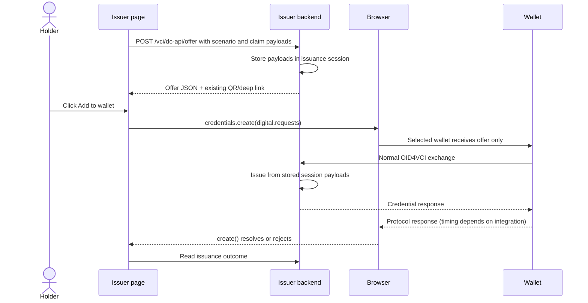

# CS-07 issuer: DC API `create()` implementation plan

Status: proposed; no runtime implementation included.
Prepared: 15 September 2026.
Target: [CS-07](core/cs-07-credential-presentation-dc-api-updated.md) §6.3 and IS-DC-01–05, with the existing CS-01 issuance policy.

## 1. What we will support

Expose an issuer demo and reusable browser adapter that deliver an existing OID4VCI credential offer to a wallet using:

```javascript
await navigator.credentials.create({
  digital: {
    requests: [{ protocol: "openid4vci-v1", data: credentialOffer }]
  },
  signal: abortController.signal
});
```

Here `credentialOffer` is the actual offer JSON, containing `credential_issuer`, `credential_configuration_ids`, and `grants`. It is not the QR image, deep-link string, complete `/vci/offer` response, or an issued credential. This direct object shape follows CS-07 §6.3.2.

The issuer backend prepares the offer. JavaScript on the issuer page calls the browser API. The selected wallet then uses the issuer's normal metadata, authorization, token, credential, and notification endpoints. Credential generation, wallet proof checks, and trust policy continue through those existing handlers.



## 2. Specification boundary and interoperability gate

The pinned [W3C Working Draft, 15 July 2026](https://www.w3.org/TR/2026/WD-digital-credentials-20260715/#protocols) defines the API and lists `openid4vci-v1`, but marks the OID4VCI integration section “Coming Soon.” It links [OpenID4VCI issue 410](https://github.com/openid/OpenID4VCI/issues/410) for that work. Treat the local CS-07 offer shape as a pre-flight integration target, not proof of a finalized interoperable binding.

Before native acceptance, record the browser version, OS, wallet version, provider registration, accepted request shape, returned response shape, and when the promise settles. Do not infer issuance support from presentation support or a browser version mentioned in CS-07. Keep response interpretation isolated in the adapter so a later binding can be accommodated.

CS-07 §6.3.4 both describes wallet storage/confirmation and says the API's role ends at offer delivery. Consequently, a resolved promise alone must not mark backend issuance successful or prove wallet storage. This is a design decision resolving that ambiguity conservatively.

Native wallet registration is an external dependency. The companion `wallet-client/` can exercise OID4VCI, but an ordinary web application is not automatically a registered DC API provider. Building a native provider or extension is a separate deliverable. Automated browser stubs test our adapter, not native interoperability.

## 3. Existing code and gaps

| Area | Current implementation | Planned use/change |
|---|---|---|
| Unified offer initiation | `routes/issue/vciStandardRoutes.js`, `GET /vci/offer` | Reuse session preparation; expose actual offer JSON through shared preparation logic. |
| Pre-authorized scenarios | `routes/issue/preAuthSDjwRoutes.js`: `/cs01-offer`, `/cs01-offer-tx-code` | Reference existing CS-01 session and transaction-code behavior. |
| Caller-supplied claim data | `POST /preauth/offer-no-code` stores `req.body` as `session.credentialPayload`; credential generation reads it in `utils/credGenerationUtils.js` | Accept a per-configuration payload list on `POST /vci/dc-api/offer` and persist it on the same issuance session before browser handoff. |
| Offer construction | `utils/routeUtils.js`: `createCredentialOfferConfig`, URI and QR helpers | Build one canonical offer and reuse it for DC API and fallback. |
| Authorization flow | `routes/issue/codeFlowSdJwtRoutes.js` | Preserve authorization, PAR, and PKCE behavior. |
| Token/credential/notification | `routes/issue/sharedIssuanceFlows.js` | Preserve enforcement and use server-observed outcomes. |
| Sessions | `services/cacheServiceRedis.js`, `utils/sessionContext.js` | Preserve Redis lifecycle and canonical session context. |
| Existing DC API | `routes/verify/dcApiRoutes.js`, `clients/dc-api/rp-client.js` | Presentation implementation only; add an issuer-specific adapter. |
| Demo hosting | `routes/verify/dcApiDemoRoutes.js`, `clients/dc-api/serve.js` | Expose issuance page and adapter alongside existing demos. |
| Logging | `server.js`, issuance route logs | Prevent new offer bodies and grant secrets from entering general HTTP logs. |

Repository-specific issues to handle during implementation:

- `/vci/offer` reads `credential_format` but does not use it to select a configuration in its flow branches. Resolve supported metadata configuration IDs explicitly; reject incompatible format/type selections. Do not advertise mdoc simply because the query parameter is accepted.
- Offer retrieval paths occur in both the standard router and other issuance routers. Test using actual server mount order so the handler reached in deployment is covered.
- Some offer retrieval handlers construct JSON without checking session existence. The new path must validate live sessions, expiry, and immutable scenario selection. Apply any necessary shared correction narrowly and regression-test legacy callers.
- Some current pre-authorized offers use the session ID as their grant code. Treat that identifier as sensitive; it must not double as an unrestricted public status credential.
- `GET /offer-no-code-batch` does not currently accept a `credentials[]` body. The live analogue is `POST /preauth/offer-no-code`, which stores a single `credentialPayload`. The DC API offer endpoint should use the caller's batch list shape and persist a per-configuration map, rather than pretending the batch GET already does this.

## 4. Backend contract

Recommended approach: add `routes/issue/dcApiIssuanceRoutes.js` with `POST /vci/dc-api/offer`, backed by shared issuance preparation extracted from existing code. Do not call our own HTTP endpoints or generate a second session just to obtain offer JSON.

Accept an allowlisted scenario ID plus optional claim payloads keyed by advertised configuration IDs. The scenario still selects grant type, signature configuration, and trust policy. The credentials list supplies the claim data that later credential generation will issue.

Two equivalent request shapes are allowed. A scenario-only body keeps the original synthetic demos:

```json
{ "scenario": "pid-pre-authorized-tx-code" }
```

A payload-bearing body follows the existing pre-auth offer pattern (`POST /preauth/offer-no-code` storing `credentialPayload` on the session), using an explicit per-credential list so batch offers work:

```json
{
  "scenario": "booking-pre-authorized",
  "signatureType": "x509",
  "credentials": [
    {
      "credential_configuration_id": "booking_reference_credential",
      "payload": {
        "booking_reference": "OTA-MS62DP17-VQPSKP",
        "hotel_id": "9213",
        "hotel_name": "Test Hotel Rhodes",
        "arrival_date": "2026-07-31",
        "departure_date": "2026-08-04",
        "booking_platform": "SEDIT-X OTA Booking Portal"
      }
    },
    {
      "credential_configuration_id": "airline_pnr_credential",
      "payload": {
        "pnr": "ABC123",
        "from": "LHR",
        "to": "CDG",
        "flight_date": "2026-08-01",
        "airline_name": "Example Air"
      }
    }
  ]
}
```

This is the same data the caller would send today to prepare a pre-authorized offer, then store in Redis before the wallet is invoked. DC API does not change that: `navigator.credentials.create()` still receives only the OID4VCI offer JSON (`credential_issuer`, `credential_configuration_ids`, `grants`). Claim payloads stay in the issuer session and are used when the wallet later hits token/credential endpoints.

When `credentials` is present:

1. Each `credential_configuration_id` MUST exist in this issuer's metadata. Reject unknown IDs.
2. Each `payload` MUST be a non-empty JSON object (`isValidCredentialPayload`). Reject arrays, strings, and empty objects.
3. The offer's `credential_configuration_ids` MUST be exactly those IDs, in request order, with duplicates rejected.
4. Persist a map `credentialPayloads[configurationId] = payload` on the issuance session. For a single-credential request also set `credentialPayload` so existing generators that read `sessionObject.credentialPayload` keep working.
5. `signatureType`, when present, MUST be one of the existing issuer signature types (`x509`, `did:web`, `did:jwk`, `kid-jwk`). Default from the scenario otherwise.
6. Apply a request-body size limit and a per-payload key/value bound so callers cannot stash unbounded data in Redis.

When `credentials` is omitted, keep scenario-owned synthetic payloads as today.

Do not accept arbitrary issuer URLs, arbitrary grants, caller-chosen pre-authorized codes, or policy bypass switches. Do not put payloads, PINs, or grant secrets into the DC API `digital.requests[].data` object, the QR/deep link, logs, or the status endpoint.

Proposed application response (these descriptor fields are not OID4VCI parameters):

```javascript
{
  sessionId,
  expiresAt,
  credentialOffer,
  digital: {
    requests: [{ protocol: "openid4vci-v1", data: credentialOffer }]
  },
  fallback: { deepLink, qr },
  statusEndpoint
}
```

Implementation requirements:

1. Create exactly one issuance session using existing flow helpers, with a server-generated ID. Persist selected configuration IDs, grant settings, and any caller-supplied `credentialPayload` / `credentialPayloads` with the canonical session context. Store payloads before returning the descriptor so a later credential request cannot race an empty session.
2. Construct the offer from that stored selection. Preserve the standard authorization-code or pre-authorized grant shape. `tx_code` in an offer describes the requested input; it must not contain the actual transaction-code secret.
3. Generate the fallback deep link/QR for the same session and equivalent offer. Reading an offer or retrying invocation must not regenerate the grant or PIN.
4. Validate metadata configuration existence and supported flow/format combinations before storing a session. Keep existing policy selection intact.
5. Return `Cache-Control: no-store`. Apply body limits, bounded scenario validation, and the deployment's issuance authorization rules. For a public testbed scenario endpoint, restrict it to configured synthetic scenarios.
6. Start with the issuer page on the same origin. If separate frontend origins are later supported, add explicit issuer-origin configuration and exact CORS; the verifier RP allowlist is not issuance authorization. Protect cookie-authenticated mutations against CSRF where applicable.
7. Redact inline grants, PINs, QR/deep links, raw browser response data, and stored claim payloads in new HTTP logging paths. Use non-secret scenario/outcome summaries (configuration IDs and payload key names only). Existing testbed diagnostic logging remains subject to `docs/knowledge.md` constraints.

For status, expose `GET /vci/dc-api/session/:id` returning only bounded outcome fields and expiry. Protect it with a same-origin owner session or a separate high-entropy read capability delivered during preparation and sent in an authorization header. Do not expose raw Redis session data or grant codes. Finalize this access mechanism alongside the existing deployment authentication model before shipping the endpoint.

Represent browser invocation state separately from issuer state. The credential endpoint can establish that issuance occurred; an appropriately validated wallet notification may add wallet-reported acceptance. Do not invent a new `/vci/dc-api/response` endpoint that issues credentials or marks success based on a browser-supplied boolean.

## 5. Browser adapter and page

Add `clients/dc-api/issuer-client.js`, an ESM module with distinct preparation and invocation functions:

- `prepareIssuance(...)`: fetch and validate a descriptor before invocation. The issuer page MAY send the `credentials` list here; the adapter must not copy payloads into `navigator.credentials.create()`.
- `getIssuanceSupport()`: check secure context, `navigator.credentials.create`, `DigitalCredential`, and `DigitalCredential.userAgentAllowsProtocol("openid4vci-v1")` where available. Report supported, unsupported, or unknown; a positive check does not prove an installed wallet exists.
- `createCredential(prepared, { signal })`: synchronously reach the `navigator.credentials.create()` call before awaiting anything. Use only the prepared `digital` payload and signal.
- A bounded status reader, if the page displays server-confirmed progress.

Use a two-step demo: select scenario and prepare; then enable **Add to wallet**. Fetching the offer inside the Add-to-wallet click handler can lose transient user activation. Disable duplicate invocations and abort pending work on explicit cancellation or page teardown.

Add `clients/dc-api/demo/issuance.html`, served at `/issuance` by the existing demo router and static server. Include scenario selection, expiry, support diagnostics, Add-to-wallet, cancel, and explicit QR/deep-link fallback. For synthetic PIN scenarios, show the PIN separately from the DC API payload using the existing testbed behavior; explain that real deployments need their intended separate delivery channel.

Error/outcome behavior:

| Result | Page behavior |
|---|---|
| API/protocol unavailable or `NotSupportedError` | Offer existing QR/deep link. |
| `NotAllowedError` | Explain that permission, activation, policy, or user cancellation may be involved; allow explicit retry. Do not silently open another wallet. |
| `AbortError` | Show invocation cancelled; do not infer that an already-started OID4VCI exchange was rolled back. |
| `SecurityError` | Show secure-context/origin-policy diagnostic. |
| Invalid descriptor, `TypeError`, unexpected protocol, null/malformed result | Report integration error without claiming success. |
| Promise resolves with expected protocol | Record browser completion; obtain issuance outcome separately. |
| Expired offer | Prepare a new session explicitly before another invocation. |

Treat protocol-specific response data as bounded, untrusted input. Do not require an invented `success: true` field. Do not put offers or responses in local storage, analytics, or DOM HTML interpolation.

Use a top-level HTTPS issuer page for initial acceptance. If iframe support is later exposed, configure and test `digital-credentials-create` Permissions Policy explicitly; presentation permission does not enable issuance. No issuer-managed BLE or CTAP implementation is needed for the same-device scope.

## 6. Implementation sequence for an agent

1. Read `docs/knowledge.md`, the current CS-07/CS-01 sources, and relevant issuance tests. Record the chosen native browser/wallet target and its evidence, or label native validation pending.
2. Extract shared offer/session preparation and add metadata-based scenario validation. Persist optional per-configuration claim payloads on the same session. Preserve current legacy response fields. Add tests for equivalence between DC API and fallback offers, including actual router mount order.
3. Add the issuer offer/status routes, session ownership, expiry behavior, and logging redaction. Mount in `server.js`. Keep presentation routing independent.
4. Implement the issuer browser adapter, with preparation separate from the user-activated invocation and explicit fallback handling.
5. Add `/issuance` demo exposure to both hosts. Wire scenario preparation, browser state, and server state into the UI.
6. Exercise each required scenario through the existing OID4VCI backend. Run relevant regression tests and native browser/wallet acceptance.
7. Update `clients/dc-api/README.md`, issuer API documentation, and `docs/knowledge.md` with runnable examples, scenario IDs, support evidence, limitations, and the distinction between pre-flight support and native interoperability.

Do not modify the CS-07 source to match implementation shortcuts. Any binding discrepancy discovered during interoperability testing should be recorded with request/response evidence and an explicit profile/version decision.

## 7. Cases to expose and test

Start with these SD-JWT VC cases using a configuration ID actually advertised by this issuer:

| Scenario | Required evidence |
|---|---|
| PID, pre-authorized, no transaction code | Offer handoff followed by successful normal token/proof/credential exchange. |
| Booking + airline PNR, pre-authorized, caller payloads | `POST /vci/dc-api/offer` stores both payloads; issued credentials contain those claims, not synthetic defaults. Payloads are absent from `digital.requests`. |
| PID, pre-authorized, transaction code | Correct input succeeds; wrong/missing input follows existing rejection policy. |
| PID, authorization code | Wallet continues through existing authorization/PAR/PKCE requirements and receives credential. |
| Unsupported browser/protocol | Same-session QR/deep-link fallback remains usable. |
| Cancel, deny, retry | No silent fallback, duplicate session creation, or false issuance-success state. |
| Invalid/expired/consumed grant | Existing enforcement remains effective through the new invocation path. |
| Invalid proof or failed required attestation/trust | Normal issuer rejection; DC API does not bypass CS-01 checks. |

Add mdoc and other credential families only after configuration mapping and a compatible wallet have been verified. Deferred issuance is a follow-up scenario: browser completion cannot stand in for deferred credential completion. Cross-device issuance is exploratory and not required by the same-device issuance scope in CS-07 §2.

Suggested new tests: `tests/cs07DcApiIssuanceRoutes.test.js`, `tests/cs07DcApiIssuerClient.test.js`, and `tests/cs07DcApiIssuanceFlow.test.js`. Cover exact request shape, fallback equivalence, grant secrecy in logs, access to status, expiry, concurrent clicks, error handling, completed backend exchange, payload persistence keyed by configuration ID, rejection of unknown configuration IDs / empty payloads, and that claim payloads never appear in the returned `credentialOffer` or `digital` object. Add a focused `test:cs07-issuance` script.

Run affected existing route, pre-auth transaction-code, shared issuance, and session-context suites, plus existing CS-07 presentation tests. Stubbed API tests must be reported separately from real native tests. A synthetic wallet completing the HTTP exchange demonstrates backend compatibility, not OS provider registration.

## 8. Acceptance and handoff

| Requirement | Implementation evidence |
|---|---|
| IS-DC-01 | Issuer page invokes `create({ digital: ... })` when supported. |
| IS-DC-02 | Adapter sends exactly `openid4vci-v1`. |
| IS-DC-03 | Offer matches metadata and stored grant; existing CS-01 policy remains enforced. Caller payloads, when present, are issued from the stored session rather than defaults. |
| IS-DC-04 | Secure-context checks and native user-activation test. |
| IS-DC-05 | Explicit usable QR/deep-link fallback for the same unexpired session. |

Implementation is ready for pre-flight testing when the endpoint, adapter, demo, and automated cases work together. Claim native interoperability only after a recorded browser/OS/wallet run completes the offer handoff and normal issuance flow. If no compatible provider is available, deliver the implementation and synthetic evidence with native validation explicitly pending.

The implementation handoff should include runnable setup, exposed scenario IDs, example descriptor, test results, native support matrix, and any unresolved response-binding detail. This plan authorizes no runtime changes by itself; it describes the work for a subsequent implementation task.
