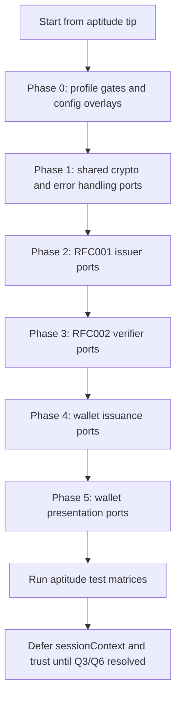

# Main → APTITUDE Alignment Plan

**Status:** Alignment ports complete on branch `aptitude-alignment` (ready for commit / PR into `aptitude`)  
**Generated:** 2026-07-29  
**Last updated:** 2026-07-29 — branch renamed to `aptitude-alignment`; validation re-run in main repo  
**Source baseline:** local committed `main` @ `daa84b6201c3850802278d9e815e18b237eda421`  
**Target baseline:** `aptitude` @ `3459bae9792d6f03575ba450fa6151c2e8747fc6`  
**Merge-base:** `6afae3fb2de187b980a84ccb4a7f9da94efad6ca` (2026-04-16)

---

## 1. Executive Summary

The `main` and `aptitude` branches diverged from a common ancestor on 2026-04-16 and have since evolved into two **incompatible profile lines**:

| Branch | Profile authority | Primary focus since June 2026 |
|--------|-------------------|------------------------------|
| `main` | WE BUILD CS-01/02/04/07, TS-12, WP4 trust | CS-02 verifier conformance stack (~20 commits), trust-list/NXD infrastructure (~6 commits), CS-01 wallet/issuer hardening (~8 commits) |
| `aptitude` | APTITUDE RFC001/002/004 | ETSI RFC001/002 ETSI enforcement, WIA/WUA wallet stack, RFC002 verifier metadata, deployed test matrices |

**Key numbers:**

| Metric | Value |
|--------|-------|
| `main` commits strictly after 2026-06-01 | **57** |
| `main` commits not in `aptitude` | **63** |
| `aptitude` commits not in `main` | **29** |
| Symmetric file diff (`main` ↔ `aptitude`) | **436 files** |
| Predicted merge conflicts (`merge-tree`) | **44 files** |

**Bottom line:** Do **not** wholesale-merge `main` into `aptitude`. Treat `main` as a **protocol fix and infrastructure library**. Cherry-pick or manually port only changes that (a) are profile-neutral or (b) map cleanly to RFC001/002/004 semantics without importing WE BUILD CS profile names, trust policies, or credential catalogs.

**Recommended strategy:** Profile-gated integration with separate test matrices (`aptitude-vci.yml`, `aptitude-vp.yml` on aptitude; WE BUILD CS suites on main).

---

## 2. Branch Baselines and Test Results

Captured in isolated worktree at `.worktrees/aptitude-align` (current `main` checkout left untouched).

### 2.1 Test suite baselines (2026-07-29)

| Suite | Branch | Result | Notes |
|-------|--------|--------|-------|
| Root `npm test` | `main` @ `daa84b6` | **1057 passing**, 1 pending, **1 failing** | Failure: `tests/metadataDiscovery.test.js` — deferred encryption override returns 401 instead of expected 200/400/500 |
| Root `npm test` | `aptitude` @ `3459bae` | **910 passing**, 19 pending, 0 failing | Pending tests are intentionally skipped suites |
| Root `npm test` | `aptitude-alignment` (after Phase 1) | **920 passing**, 19 pending, 0 failing | +10 tests vs aptitude baseline; no new failures |
| Root `npm test` | `aptitude-alignment` (after Phase 2) | **932 passing**, 19 pending, 0 failing | +12 tests (issuerMetadataSigning, preAuthTxCodeOffer) |
| Root `npm test` | `aptitude-alignment` (after Phase 3) | **938 passing**, 19 pending, 0 failing | +6 tests (dcqlCore, claim utilities) |
| `wallet-client/npm test` | `aptitude-alignment` (after Phase 2) | **132 passing**, 0 failing | Fixed `scopeResolution.test.js` missing-scope rejection |
| `wallet-client/npm test` | `aptitude-alignment` (after Phase 3) | **157 passing**, 0 failing | +25 tests (dcqlCredentialSelection claim/credential_sets) |
| `wallet-client/npm test` | `aptitude-alignment` (after Phase 4) | **165 passing**, 0 failing | +8 tests (metadata discovery, attestation challenge, WUA c_nonce) |
| `wallet-client/npm test` | `aptitude-alignment` (after Phase 5) | **181 passing**, 0 failing | +16 tests (openid4vpUri, sdJwtDisclosureSelection, dcqlVpToken fixtures) |
| Docker build | `aptitude-alignment` (after Phase 7) | **Build OK** | `docker build -f wallet-client/Dockerfile .` from monorepo root; root `utils/` in context |
| `wallet-client/npm test` | `aptitude-alignment` (attestation challenge wiring) | **183 passing**, 0 failing | +2 tests (`issuanceAttestationChallenge`) |
| Root `npm test` | `aptitude-alignment` (final) | **941 passing**, 19 pending, 0 failing | +31 vs aptitude baseline; DCQL path/value fixes, tx_code, signed metadata |
| `wallet-client/npm test` | `aptitude-alignment` (final) | **186 passing**, 0 failing | +55 vs aptitude baseline; DCQL presentation wiring, disclosure wildcards |
| Docker build | `aptitude-alignment` (final) | **Build OK** | `cd wallet-client && npm run docker:build` (`-f Dockerfile ..`) |
| `wallet-client/npm test` | `main` @ `daa84b6` | **321 passing**, 0 failing | CS-01/02 profile wallet architecture |
| `wallet-client/npm test` | `aptitude` @ `3459bae` | **131 passing**, **1 failing** | Failure: `wallet-client/test/scopeResolution.test.js` — missing-scope rejection expectation |

These baseline failures are **pre-existing** on each branch and must not be attributed to alignment work. Any ported change must not increase failure counts without an explicit RFC-driven fix.

### 2.2 Divergence topology

```
merge-base (6afae3f, 2026-04-16)
├── main (+63 commits) ──► daa84b6 (2026-07-29)
│   WE BUILD CS-01/02/04/07, TS-12, WP4 trust, sessionContext
└── aptitude (+29 commits) ──► 3459bae (2026-07-15)
    RFC001/002/004, ETSI 472, WIA/WUA wallet stack
```

**None** of the 57 post-June-1 `main` commits appear in `aptitude` ancestry.

---

## 3. APTITUDE Non-Negotiable Guardrails

Authority order on `aptitude` (from [`docs/knowledge.md`](./knowledge.md)):

1. Published standards and errata (OpenID4VCI 1.0, OpenID4VP 1.0, HAIP, ETSI TS 119 472, ISO 18013-7, RFC 5280/6960)
2. APTITUDE profiles: [`docs/core/RFC001.md`](./core/RFC001.md), [`RFC002.md`](./core/RFC002.md), [`RFC004.md`](./core/RFC004.md)
3. Current configuration, implementation, and tests
4. This document and other design aids

### 3.1 RFC001 issuance invariants (must not be weakened)

| ID | Requirement | RFC001 reference | APTITUDE implementation evidence | Port constraint |
|----|-------------|------------------|----------------------------------|-----------------|
| R001-01 | Both `authorization_code` and `urn:ietf:params:oauth:grant-type:pre-authorized_code` grants | §7.1, §6.2/6.3 | `data/oauth-config.json`; `sharedIssuanceFlows.js` | Do not remove either grant |
| R001-02 | PAR required for authorization-code flow | §7.3 | `codeFlowSdJwtRoutes.js`; `aptitude-vci.yml` VCI-005/009 | Do not relax PAR requirement |
| R001-03 | PKCE S256 | §7.3 | `validatePKCE` in shared issuance | Mandatory |
| R001-04 | DPoP sender-constrained tokens (`Authorization: DPoP` at resource endpoints) | §7.4 | `tokenUtils.js`; knowledge.md hardening note | Do not reintroduce Bearer fallback for bound tokens |
| R001-05 | WIA + PoP at PAR and Token | §7.4 | `validateWIA`, `oauthClientAttestation.js`; wallet `wiaParTokenValidation.js` | CS-01 naming must not replace RFC001 validation paths |
| R001-06 | WUA/key attestation at credential request | §7.5, §7.5.1/7.5.2 | `validateWUA`, `keyAttestationProof.js`; wallet `wuaCredentialBinding.js` | mdoc: `proofs.attestation` only (VCI-CHECK-08) |
| R001-07 | `proofs.jwt` (SD-JWT) or `proofs.attestation` (mdoc) — exactly one proof type | §7.5 | `sharedIssuanceFlows.js`; wallet `credentialRequestProofs.js` | Do not revert to legacy `proof` |
| R001-08 | Same-device offer scheme `eu-eaa-offer://` | §8.1, §5.1 | `credentialOfferScheme.js`; `vciStandardRoutes.js`; `aptitude-vci.yml` | Do not replace with `haip://` or `openid-credential-offer://` as sole scheme |
| R001-09 | Signed issuer metadata with `x5c` in JWS protected header | §5.1, §7.7 | Partial — ETSI enforcement hooks exist; full signing may be incomplete | Any port of signed metadata must use APTITUDE issuer cert chain, not WE BUILD verifier P12 |
| R001-10 | `issuer_info` metadata parameter | §5.1, §7.7 | `utils/issuerInfo.js`; `data/issuer-registration.json` | Preserve APTITUDE registration material |
| R001-11 | Credential response encryption A128GCM + A256GCM (`ECDH-ES`) | §5.1 (ETSI aligned) | `credentialResponseEncryption.js`; VCI-009/010 | Mandatory algorithms |
| R001-12 | Deferred issuance via `transaction_id` (not `acceptance_token`) | §6.3, §7.6 | `sharedIssuanceFlows.js`; wallet `deferredIssuancePoll.js` | Align with RFC001 semantics |
| R001-13 | Credential configuration IDs (`ETSIRfc001PidVcSdJwt`, etc.) | §10 deployed matrix | `data/issuer-config.json`; `aptitude-vci.yml` | Do not replace with WE BUILD PID rulebook URNs |
| R001-14 | X.509 issuer signing via `./x509EC/client_certificate.crt` | §10 deployed matrix | `aptitude-vci.yml`; issuer config | Separate from WE BUILD verifier/JAR P12 |

### 3.2 RFC002 presentation invariants (must not be weakened)

| ID | Requirement | RFC002 reference | APTITUDE implementation evidence | Port constraint |
|----|-------------|------------------|----------------------------------|-----------------|
| R002-01 | ETSI SD-JWT track: `client_id` prefix **`x509_hash` only** in §11.2 matrix | §8.2.2, §11.2 | `aptitude-vp.yml`; `vpStandardRoutes.js` | Do not require CS-02 DID:web trust policy |
| R002-02 | Signed JAR (`typ: oauth-authz-req+jwt`) | §8.2.2 | `cryptoUtils.js`, `routeUtils.js` | Preserve |
| R002-03 | `request_uri` parameter (not by-value request object) for ETSI flows | §8.2.2 | `vpStandardRoutes.js`; VP-001..006 | Mandatory for deployed matrix |
| R002-04 | `verifier_info` in request object | §8.2.2 | `data/verifier-info.json`; `verifierInfoNormalize.js` | Do not replace with CS-02 metadata model alone |
| R002-05 | Encrypted response mode `direct_post.jwt` | §8.3.2 | `verifierRoutes.js`; all VP matrix rows | Mandatory for ETSI track |
| R002-06 | SD-JWT KB-JWT: signature, `aud`, `nonce`, `sd_hash` vs credential `cnf.jwk` | §8.3.3 | `sdJwtKeyBinding.js`; wallet `presentationKeyBinding.js` | Already present on both branches |
| R002-07 | Nested DCQL claim paths validated before acceptance | §7.1, §8.2.4 | `dcqlClaimValidation.js`; wallet `dcqlClaimsPaths.js` | Port claim-path utilities, not CS-02 module wholesale |
| R002-08 | mdoc track: `mdoc-openid4vp://` invocation (VP-007) | §5.6, §8.1 | `aptitude-vp.yml` VP-007 | Do not conflate with generic `openid4vp://` |
| R002-09 | mdoc `DeviceResponse` in `vp_token`, `SessionTranscript` binding | §8.3.3.1, §8.2.5 | `mdlVerification.js`; wallet mdoc tests | ISO 18013-7 crypto still partial — do not overclaim |
| R002-10 | Strict metadata projection at `/client-metadata/rfc002` | knowledge.md | `metadataroutes.js`; `openidVerifierMetadata.test.js` | Preserve RFC002 metadata shape |
| R002-11 | Invocation schemes: `openid4vp://`, `eu-eaap://` (VP-006A), `mdoc-openid4vp://` | §8.1 | `aptitude-vp.yml`; route query params | Per-matrix only |
| R002-12 | TS-12 payment SCA | — | **Out of scope** on aptitude (knowledge.md) | Do not port TS-12 routes/utils |

### 3.3 RFC004 trust/revocation invariants

| ID | Requirement | RFC004 reference | APTITUDE status | Port constraint |
|----|-------------|------------------|-----------------|-----------------|
| R004-01 | Wallet CRL consumption | §7.1 | Not implemented end-to-end | Do not import WE BUILD WP4 trust-list as substitute |
| R004-02 | Wallet OCSP consumption | §7.2 | Not implemented | Same |
| R004-03 | Wallet Status List Token consumption | §7.3 | Partial helper in `vpHeplers.js` | Port status-list parsing logic only if RFC004-scoped |
| R004-04 | WIA/WUA trust-list validation | §6.1 | Hooks only (`isWuaWalletProviderTrustedByPolicy`) | **Do not** port `trust/` WP4 module without RFC004/APTITUDE trust evidence |
| R004-05 | No CRL/OCSP/TSL provider routes in this repo | §6.2/6.3 | Confirmed absent | Preserve |

### 3.4 APTITUDE-only artifacts that must survive alignment

| Artifact | Purpose | Why it must not be overwritten |
|----------|---------|-------------------------------|
| [`aptitude-vci.yml`](../aptitude-vci.yml) | RFC001 §10 deployed VCI matrix (VCI-005..010) | Defines conformance test URLs and expected checks |
| [`aptitude-vp.yml`](../aptitude-vp.yml) | RFC002 §11.2 deployed VP matrix (VP-001..007, VP-006A) | Defines `x509_hash`-only ETSI track |
| [`docs/core/RFC001.md`](./core/RFC001.md), [`RFC002.md`](./core/RFC002.md), [`RFC004.md`](./core/RFC004.md) | Normative APTITUDE profiles | Authority source — not replaceable by CS-0* docs |
| [`docs/references/aptitude/`](../references/aptitude/) | APTITUDE trust references | RFC004 supporting material |
| [`data/issuer-registration.json`](../data/issuer-registration.json) | Issuer registration / `issuer_info` | RFC001 §5.1 ETSI metadata |
| [`data/verifier-info.json`](../data/verifier-info.json) | Verifier registration for `verifier_info` | RFC002 §8.2.2 |
| [`routes/multiCredentialOfferRoutes.js`](../routes/multiCredentialOfferRoutes.js) | OID4VCI 1.0 multi-credential offers | Replaces deprecated batch endpoint |
| Wallet RFC001 stack | `issuance.js`, `wiaParTokenValidation.js`, `wuaCredentialBinding.js`, `credentialOfferScheme.js`, etc. | Parallel architecture to main's CS-01 profile modules |
| [`reports/rfc001-alignment-backlog.md`](../reports/rfc001-alignment-backlog.md) | Open RFC001 gaps | Tracks partial implementations |
| [`reports/rfc002-verifier-compliance-review.md`](../reports/rfc002-verifier-compliance-review.md) | Open RFC002 gaps | Tracks partial implementations |
| ETSI enforcement flags | `ENFORCE_ETSI_ISSUANCE_PROFILE` in issuer routes | APTITUDE-specific profile gate |

---

## 4. Main Post-June-1 Commit Ledger (57 rows)

Disposition legend:

| Disposition | Meaning |
|-------------|---------|
| **PORT** | Safe to port with minimal adaptation |
| **PORT WITH APTITUDE ADAPTATION** | Valuable but requires remapping from CS→RFC or profile-specific config |
| **ALREADY PRESENT/EQUIVALENT** | Aptitude already has equivalent behavior |
| **DEFER PENDING SPEC EVIDENCE** | Needs RFC001/002/004 confirmation before porting |
| **DO NOT PORT** | WE BUILD-specific or out of APTITUDE scope |

---

### Category A — Certificates, Crypto, Key Hygiene

| # | Hash | Date | Message | Intent | Primary paths | Aptitude overlap | RFC refs | Disposition |
|---|------|------|---------|--------|---------------|------------------|----------|-------------|
| 1 | `82807330` | 2026-06-01 | Add PID Issuer CA 02 EU Certificate | Extend JAR `x5c` chain for X.509 JAR validation | `certs/pidissuerca02_eu.pem`, `utils/cryptoUtils.js`, `tests/jarX5cChain.test.js` | Aptitude uses `./x509EC/client_certificate.crt` for issuer signing; JAR chain may differ | R002-02 (signed JAR) | **DEFER PENDING SPEC EVIDENCE** — port CA only if APTITUDE JAR validation requires same chain |
| 50 | `fec4e8fb` | 2026-07-23 | Key material docs + `deprecated/` | Canonical key paths; move backups out of runtime | `deprecated/**`, `utils/keyMaterialPaths.js`, `tests/keyMaterialInventory.test.js` | Aptitude has different key layout (removed X25519); no `keyMaterialPaths.js` | — (infra) | **PORT WITH APTITUDE ADAPTATION** — adopt hygiene pattern with aptitude-specific paths |
| 49 | `d1562c0a` | 2026-07-23 | JWE decryption + enc key tests | Fail-closed when advertised enc JWK ≠ private key | `utils/verifierEncryptionKeys.js`, `routes/verify/verifierRoutes.js` | Aptitude has encrypted VP (`direct_post.jwt`) but no central enc-key registry | R002-05 | **PORT** |
| 44 | `51fda35f` | 2026-07-20 | Verifier encryption key registry | Centralize EC P-256 enc key selection | `utils/verifierEncryptionKeys.js` | Partial — aptitude decrypts in `verifierRoutes.js` directly | R002-05 | **PORT** (depends on #49) |

---

### Category B — CS-01 / RFC001 Issuance (Wallet + Issuer)

| # | Hash | Date | Message | Intent | Primary paths | Aptitude overlap | RFC refs | Disposition |
|---|------|------|---------|--------|---------------|------------------|----------|-------------|
| 2 | `9648b5a4` | 2026-06-02 | CS-01 wallet refactor | Introduce `webuild-cs01` profile; modular wallet (`profile.js`, `cs01Conformance.js`, `dpopBinding.js`, `walletUnitAttestation.js`); delete `index.js` | `wallet-client/src/**` | Aptitude has parallel RFC001 stack (`issuance.js`, `wiaParTokenValidation.js`, etc.) — **different architecture** | R001-04..07 | **DO NOT PORT (bulk)** — underlying DPoP/WUA patterns may inform fixes only |
| 3 | `6971b42e` | 2026-06-02 | Attestation options docs | CS-01 WUA/PAR/proof binding reference doc | `docs/haip-etsi-wallet-attestation-options.md` | Aptitude has `docs/aptitude-rfc001-wallet-attestation-implementation-plan.md` | R001-05/06 | **DO NOT PORT** — WE BUILD doc; cross-reference concepts only |
| 4 | `260fecec` | 2026-06-05 | CS-01 deferred issuance wallet | Wallet-side deferred polling | `wallet-client/src/lib/deferredIssuance.js` | Aptitude has `deferredIssuancePoll.js` | R001-12 | **ALREADY PRESENT/EQUIVALENT** |
| 5 | `5af44e1c` | 2026-06-15 | Issuer CS-01 + deferred poll | Issuer deferred poll, stricter errors, pre-auth enhancements | `sharedIssuanceFlows.js`, `utils/deferredCredentialPoll.js`, `preAuthSDjwRoutes.js` | Aptitude has deferred context in shared flows; different enforcement gates | R001-12 | **PORT WITH APTITUDE ADAPTATION** — port error handling and poll logic, not CS-01 flags |
| 6 | `19c36f42` | 2026-06-18 | Attestation challenge | OAuth attestation challenge for WUA | `attestationChallenge.js`, WUA/DPoP libs | Not present on aptitude | R001-05/06 | **DEFER PENDING SPEC EVIDENCE** — verify RFC001 mandates attestation challenge |
| 11 | `7ff00806` | 2026-07-03 | Offer error handling | Better OID4VCI error surfaces on malformed offers | `preAuthSDjwRoutes.js`, `sharedIssuanceFlows.js`, `routeUtils.js` | Partial overlap | R001-01 | **PORT** |
| 12 | `b3c0f176` | 2026-07-03 | Pre-auth TX code tests | TX code pre-auth test coverage | `tests/preAuthTxCodeOffer.test.js` | Not on aptitude | R001-01 | **PORT WITH APTITUDE ADAPTATION** — if RFC001 pre-auth tx_code in matrix |
| 31 | `25093738` | 2026-07-10 | DPoP/Bearer refactor | Unified token auth header; DPoP required for bound tokens | `tokenUtils.js`, `sharedIssuanceFlows.js` | Aptitude already mandates DPoP (knowledge.md); partial overlap in `tokenUtilsAuthorization.test.js` | R001-04 | **PORT** — verify no Bearer regression |
| 46 | `c8f0cf9d` | 2026-07-21 | CS-07 session + scope resolution | `authorization_details` / credential_identifier handling | `scopeResolution.js`, wallet server | Aptitude has `scopeResolution.js` (1 failing test) | R001-01 | **PORT WITH APTITUDE ADAPTATION** — port identifier logic, fix failing test |
| 48 | `622f0817` | 2026-07-23 | Issuer metadata signing + config | Signed metadata JWT, PID rulebook, issuer config refactor | `issuerMetadataSigning.js`, `data/issuer-config.json`, `pid-rulebook.md` | Aptitude advertises signed metadata (R001-09) but may not fully implement | R001-09/10 | **PORT WITH APTITUDE ADAPTATION** — port signing util only; **skip** WE BUILD config bulk |
| 49b | `caee5133` | 2026-07-23 | URN formats + config restore | WE BUILD credential catalog URNs | `data/issuer-config.json` | Incompatible with APTITUDE `ETSIRfc*` IDs | R001-13 | **DO NOT PORT** |

---

### Category C — SD-JWT Key Binding & mdoc Interop

| # | Hash | Date | Message | Intent | Primary paths | Aptitude overlap | RFC refs | Disposition |
|---|------|------|---------|--------|---------------|------------------|----------|-------------|
| 7 | `b3e98a51` | 2026-06-23 | SD-JWT KB refactor | Refine KB-JWT validation and errors | `sdJwtKeyBinding.js`, `verifierRoutes.js` | Aptitude has equivalent from `98130cd` lineage | R002-06 | **ALREADY PRESENT/EQUIVALENT** — compare for minor fixes only |
| 32 | `01f4bb68` | 2026-07-10 | SD-JWT claim paths | Nested DCQL claim-path matching | `utils/sdJwtClaims.js`, CS-02 response | Aptitude has `dcqlClaimValidation.js` (simpler) | R002-07 | **PORT WITH APTITUDE ADAPTATION** — extract claim-path utils, not CS-02 wiring |
| 30 | `f4e8de61` | 2026-07-10 | DCQL claim + mdoc handling | mdoc claim matching in verifier response | `utils/mdocClaims.js`, CS-02 response | Aptitude has mdoc validation in `mdlVerification.js` | R002-07/09 | **PORT WITH APTITUDE ADAPTATION** — port `mdocClaims.js` helpers |
| 28 | `1ce20cc8` | 2026-07-09 | MDOC in verifier response | mdoc branches in CS-02 response validator | `cs02VerifierResponse.js` | Aptitude handles mdoc in `verifierRoutes.js` | R002-09 | **PORT WITH APTITUDE ADAPTATION** — behavior only, not CS-02 module |

---

### Category D — TS-12 Payment SCA (Out of APTITUDE scope)

| # | Hash | Date | Message | Disposition | Evidence |
|---|------|------|---------|-------------|----------|
| 8 | `932e23b2` | 2026-06-26 | TS-12 routes + WUA enforcement + CS docs | **DO NOT PORT** | knowledge.md: "TS-12 payment-SCA remains out of scope" |
| 10 | `89509f6c` | 2026-07-02 | TS-12 DCQL query fix | **DO NOT PORT** | Depends on TS-12 |
| 16 | `ea61b6a2` | 2026-07-07 | Merge TS-12 + present invocation | **DO NOT PORT** | Merge commit; TS-12 portion excluded |
| 37 | `8f51a460` | 2026-07-14 | TS-12 wallet presentation | **DO NOT PORT** | R002-12 |
| 38 | `7f315ccd` | 2026-07-15 | TS-12 data model wallet | **DO NOT PORT** | R002-12 |

---

### Category E — CS-04 WUA Lifecycle

| # | Hash | Date | Message | Disposition | Notes |
|---|------|------|---------|-------------|-------|
| 9 | `4cce0e64` | 2026-06-26 | WUA test YAML refactor | **DO NOT PORT** | WE BUILD CS-04 fixtures |
| 47 | `75c457fb` | 2026-07-22 | CS-04 KA docs + nonce binding | **PORT WITH APTITUDE ADAPTATION** | KA `c_nonce` binding in wallet may map to RFC001 WUA — port logic from `credentialProofBinding.js` / `walletUnitAttestation.js`, skip CS-04 docs |

Note: `932e23b2` also added `wuaEnforcementPolicy.js` — **DEFER** unless RFC001 strict WUA enforcement is confirmed required beyond current aptitude hooks.

---

### Category F — CS-02 Verifier Stack (Jul 9–16) — Bulk exclusion

| # | Hash | Date | Message | Disposition | Rationale |
|---|------|------|---------|-------------|-----------|
| 17 | `4a1b1c49` | 2026-07-09 | CS-02 FCAF alignment plan | **DO NOT PORT** | WE BUILD FCAF artifact |
| 18 | `65f07a56` | 2026-07-09 | Wallet CS-02 request validation | **DO NOT PORT (bulk)** | Aptitude has RFC002 validation in `presentation.js` / wallet tests |
| 19 | `9db7f678` | 2026-07-09 | CS-02 DCQL validation | **DO NOT PORT (bulk)** | Aptitude has `dcqlClaimValidation.js`, `dcqlCredentialSelection.js` |
| 20 | `2b630682` | 2026-07-09 | DCQL selection enhancements | **PORT WITH APTITUDE ADAPTATION** | Compare selection edge cases with aptitude `d4ceb38` fix |
| 21 | `bac7e9f3` | 2026-07-09 | Verifier request CS-02 | **DO NOT PORT (bulk)** | CS-02 trust-policy hooks; aptitude uses RFC002 request builders |
| 22 | `3b0a989c` | 2026-07-09 | Verifier response + trust policy | **DO NOT PORT (bulk)** | CS-02 + WE BUILD trust policy |
| 23 | `e36d0f0a` | 2026-07-09 | FCAF coverage update | **DO NOT PORT** | Documentation |
| 24 | `42e3b765` | 2026-07-09 | CS-02 remaining issues plan | **DO NOT PORT** | Documentation |
| 25 | `004b62a4` | 2026-07-09 | DID:web trust policy | **DO NOT PORT** | R002-01: aptitude matrix is `x509_hash` only |
| 26 | `b13bb2f9` | 2026-07-09 | CS-02 client metadata | **DO NOT PORT (bulk)** | Aptitude has RFC002 metadata projection |
| 27 | `3736ee17` | 2026-07-09 | CS-02 metadata + trust refactor | **DO NOT PORT (bulk)** | |
| 29 | `78bd53b4` | 2026-07-10 | CS-02 testing + RFC HTML imports | **DO NOT PORT** | Aptitude has references under `docs/references/` |
| 34 | `1ad700ed` | 2026-07-10 | CS-02 doc coverage update | **DO NOT PORT** | Documentation |
| 35 | `14c6f73e` | 2026-07-13 | Client ID + knowledge.md | **PORT WITH APTITUDE ADAPTATION** | Client_id normalization may help RFC002; skip main knowledge.md |
| 39 | `3cedf800` | 2026-07-15 | CS-02 OpenID4VP validation | **DO NOT PORT (bulk)** | |
| 40 | `44c4b49d` | 2026-07-16 | FCAF disposition register | **DO NOT PORT** | WE BUILD FCAF |
| 41 | `e564867c` | 2026-07-16 | FCAF disposition enhancements | **DO NOT PORT** | WE BUILD FCAF |
| 45 | `b96b7eb3` | 2026-07-20 | FCAF disposition JSON tweak | **DO NOT PORT** | WE BUILD FCAF |

**Extractable protocol helpers from Category F (conditional):**

- `utils/sdJwtClaims.js`, `utils/mdocClaims.js`, `utils/cs02DcqlCore.js`, `utils/cs02Encoding.js` — **PORT WITH APTITUDE ADAPTATION** as standalone utilities decoupled from CS-02 naming and trust policy

---

### Category G — Logging, Metadata Discovery, Session Architecture

| # | Hash | Date | Message | Intent | Disposition | Notes |
|---|------|------|---------|--------|-------------|-------|
| 36 | `36bcda04` | 2026-07-13 | Metadata discovery + logging | `Accept` header handling, AsyncLocalStorage logger, scope resolution | **PORT WITH APTITUDE ADAPTATION** | Port metadata discovery rules (R001); logging architecture optional for test framework |
| 55 | `cd92e95d` | 2026-07-27 | sessionContext + logging migration | Versioned `sessionContext` envelope; route migration | **DEFER PENDING SPEC EVIDENCE** | High conflict risk with aptitude session work; significant cross-cutting refactor |

---

### Category H — CS-07 Digital Credentials API

| # | Hash | Date | Message | Disposition |
|---|------|------|---------|-------------|
| 42 | `4c946fb0` | 2026-07-17 | CS-07 plan | **DO NOT PORT** |
| 43 | `81e1a3b6` | 2026-07-20 | CS-07 implementation | **DO NOT PORT** |
| 44b | `51fda35f` | 2026-07-20 | CS-07 demo (partial) | **DO NOT PORT** (enc key portion covered in Category A) |

---

### Category I — WE BUILD Trust Framework & NXD (Jul 27–28)

| # | Hash | Date | Message | Disposition | Evidence |
|---|------|------|---------|-------------|----------|
| 52 | `bc1fdd97` | 2026-07-27 | Trust-list initial docs | **DO NOT PORT** | WP4-specific; aptitude uses RFC004 + ETSI 472 analysis |
| 53 | `f8c30e6e` | 2026-07-27 | Trust framework Phase 3 | **DO NOT PORT** | Conflicts with RFC004 trust model (R004-04) |
| 54 | `eec55810` | 2026-07-27 | Trust session + pointer selection | **DO NOT PORT** | WP4 LoTL logic |
| 56 | `a779cf05` | 2026-07-27 | WP4 pilot profile + revocation | **DO NOT PORT** | `data/trust/webuild-wp4-pilot.json` |
| 57 | `e734a288` | 2026-07-28 | NXD onboarding + wallet trust | **DO NOT PORT** | NXD submission artifacts; `wallet-client/src/lib/trustFramework.js` |

---

### Category J — Documentation & DevOps

| # | Hash | Date | Message | Disposition |
|---|------|------|---------|-------------|
| 13 | `d3dad42f` | 2026-07-03 | Canonical CS specs under `docs/core/` | **DO NOT PORT** — aptitude uses RFC001/002/004 in `docs/core/` |
| 14 | `02a9db08` | 2026-07-07 | Present invocation URI (branch A) | **PORT WITH APTITUDE ADAPTATION** — compare with aptitude `43e9434` invocation work |
| 15 | `1ea5635a` | 2026-07-07 | Present invocation URI (branch B) | **ALREADY PRESENT/EQUIVALENT** — duplicate topic |
| 33 | `cc02275d` | 2026-07-10 | Docker compose + import paths | **PORT WITH APTITUDE ADAPTATION** — monorepo build context pattern |
| 58 | `daa84b62` | 2026-07-29 | Docker config + wallet docs | **PORT WITH APTITUDE ADAPTATION** — Docker/docs only; verify against aptitude `wallet-client/Dockerfile` |

---

## 5. Disposition Summary

| Disposition | Count (approx.) | Action |
|-------------|-----------------|--------|
| **PORT** | 6 | Cherry-pick or manual port with tests |
| **PORT WITH APTITUDE ADAPTATION** | 18 | Extract protocol logic; remap config and naming |
| **ALREADY PRESENT/EQUIVALENT** | 4 | Verify parity; optional minor fixes |
| **DEFER PENDING SPEC EVIDENCE** | 4 | Requires RFC/spec confirmation |
| **DO NOT PORT** | 25 | Document exclusion rationale |

---

## 6. Dependency-Ordered Port Backlog

### Phase 0 — Preconditions (before any port)

| # | Item | Status |
|---|------|--------|
| 1 | Create integration branch from `aptitude` tip | **DONE** — branch `aptitude-alignment` (checked out in main repo) |
| 2 | Add profile env gates (`ISSUANCE_PROFILE=aptitude-rfc001`, `VP_PROFILE=aptitude-rfc002`) | **DEFER** — dual-profile infrastructure; aptitude uses `ENFORCE_ETSI_ISSUANCE_PROFILE` today |
| 3 | Split issuer/verifier config into base + aptitude overlay | **DEFER** — dual-profile infrastructure; aptitude configs remain authoritative |
| 4 | Establish separate npm scripts (`test:aptitude`, `test:webuild`) | **DONE** — root `test:aptitude`; `test:webuild` N/A on aptitude branch |

### Phase 1 — Shared foundations (low conflict)

| Item | Source commits | Source files | Target files | RFC refs | Status |
|------|----------------|--------------|--------------|----------|--------|
| Verifier encryption key registry | `51fda35f`, `d1562c0a` | `utils/verifierEncryptionKeys.js` | Same (RFC002-compatible, no CS-02) | R002-05 | **DONE** — wired in `verifierRoutes.js`; fixed stale enc JWK in `verifier-config.json` |
| Key material inventory | `fec4e8fb` | `utils/keyMaterialPaths.js`, `deprecated/` | Adapted aptitude paths | — | **DONE** — backups moved to `deprecated/`; inventory test passes |
| Offer error handling | `7ff00806` | `preAuthSDjwRoutes.js`, `sharedIssuanceFlows.js`, `routeUtils.js` | Same | R001-01 | **DONE** — tx_code in offers; explicit `invalid_grant` handler |
| DPoP authorization header | `25093738` | `tokenUtils.js`, `sharedIssuanceFlows.js` | Same | R001-04 | **DONE** (pre-existing on aptitude) — no port needed |

**Phase 1 acceptance:** Root `npm test` — **920 passing**, 19 pending, 0 failing (2026-07-29).

### Phase 2 — Issuer / RFC001

| Item | Source commits | Adaptation required | RFC refs | Status |
|------|----------------|---------------------|----------|--------|
| Deferred credential poll (issuer) | `5af44e1c` | Remove CS-01 flags; keep `transaction_id` poll | R001-12 | **DONE** (pre-existing on aptitude) — inline deferred poll with expiry, DPoP, `DEFERRED_PENDING_POLLS` |
| Scope / credential_identifier resolution | `c8f0cf9d` | Merge into aptitude `scopeResolution.js`; fix failing wallet test | R001-01 | **DONE** — wallet throws on missing scope; `assertAuthorizationDetailsSupportForCredentialRequest` fallback preserved; issuer-side `resolveCredentialIdentifierFromOpenidCredentialEntry` already present |
| Signed issuer metadata | `622f0817` | Use APTITUDE issuer cert (`x509EC`), not WE BUILD P12 | R001-09 | **DONE** — extracted `utils/issuerMetadataSigning.js`; wired in `metadataroutes.js` with fail-closed 503 |
| Pre-auth TX code tests | `b3c0f176` | APTITUDE routes only (no CS-01 route) | R001-01 | **DONE** — `tests/preAuthTxCodeOffer.test.js` |

**Phase 2 acceptance:** Root `npm test` — **932 passing**, 19 pending, 0 failing; wallet `npm test` — **132 passing** (2026-07-29).

### Phase 3 — Verifier / RFC002

| Item | Source commits | Adaptation required | RFC refs | Status |
|------|----------------|---------------------|----------|--------|
| SD-JWT claim path utilities | `01f4bb68` | Extract `sdJwtClaims.js`; wire into DCQL validation, not CS-02 module | R002-07 | **DONE** — `utils/sdJwtClaims.js`; `dcqlClaimValidation.js` uses dotted/nested path resolution |
| mdoc claim extraction helpers | `f4e8de61`, `1ce20cc8` | Port `mdocClaims.js`; namespace path matching | R002-07/09 | **DONE** — `utils/mdocClaims.js`; wallet re-exports under `wallet-client/utils/` |
| Client ID normalization | `14c6f73e` | Apply to RFC002 `x509_hash` paths only | R002-01 | **DONE** (pre-existing) — `resolveVerifierX509ClientId`, `patchVpSessionClientIdIfMissing` |
| DCQL selection edge cases | `2b630682` | Compare with aptitude `d4ceb38` fix | R002-07 | **DONE** — wallet `dcqlCredentialSelection.js` ported with `dcqlCore.js`, claim_sets, credential_sets, `multiple=true` |

**Phase 3 acceptance:** Root `npm test` — **938 passing**; wallet `npm test` — **157 passing** (2026-07-29).

### Phase 4 — Wallet issuance (RFC001)

| Item | Source commits | Adaptation required | Status |
|------|----------------|---------------------|--------|
| Metadata discovery + Accept header | `36bcda04` | Port discovery rules into `issuerMetadataFetch.js` / `server.js` | **DONE** — `ISSUER_METADATA_ACCEPT_SEQUENCE`; signed-metadata-first with JSON fallback; `trimCompactJws` hardened |
| Attestation challenge | `19c36f42` | RFC001 WIA path, not CS-01 profile | **DONE** — `attestationChallenge.js` + tests; WIA PoP `challenge` claim; retry in `exchangeToken`, PAR, pre-auth/code flows |
| KA c_nonce binding | `75c457fb` | Port binding checks into WUA stack | **DONE** — `c_nonce` in WUA payload; `assertWuaNonceMatchesCNonce` in `wuaCredentialBinding.js` |

**Phase 4 acceptance:** Wallet `npm test` — **183 passing** (2026-07-29); root suite unchanged at **938 passing**.

### Phase 5 — Wallet presentation (RFC002)

| Item | Source commits | Adaptation required | Status |
|------|----------------|---------------------|--------|
| OpenID4VP present invocation URI | `02a9db08` | RFC002 `openid4vp://present?` authority; keep `mdoc-openid4vp:` / `eu-eaap:` | **DONE** — `wallet-client/src/lib/openid4vpUri.js`; `buildVPbyValue` + `parseOpenId4VpDeepLink` updated |
| SD-JWT disclosure selection improvements | `01f4bb68` (wallet side) | Use `dcqlCore`/`sdJwtClaims` (not CS-02); `DcqlDisclosureSelectionError` | **DONE** — `sdJwtDisclosureSelection.js`; `presentation.js` delegates filtering; tests ported |

**Phase 5 acceptance:** Wallet `npm test` — **181 passing** (2026-07-29); root suite unchanged at **938 passing**.

### Phase 6 — Session / logging (deferred)

| Item | Source commits | Status |
|------|----------------|--------|
| sessionContext envelope | `cd92e95d` | **DEFER** — reconcile with aptitude `vpSessionCorrelation.js` and Redis session shape first |

### Phase 7 — Configuration & deployment

| Item | Source commits | Adaptation | Status |
|------|----------------|------------|--------|
| Docker monorepo build context | `cc02275d`, `daa84b62` | Root `utils/` in build context; no `trust/` or CS-01 env vars | **DONE** — `wallet-client/Dockerfile`, compose volume path `/workspace/wallet-client/keys`, `docker:build` script, `DOCKER.md` |
| Key material deprecated layout | `fec4e8fb` | Map aptitude key directories | **DONE** (Phase 1) — `utils/keyMaterialPaths.js`, `deprecated/` tree, inventory test |

**Phase 7 acceptance:** Docker image builds from monorepo root; module imports resolve inside container; test suites unchanged (**938 root**, **181 wallet**).

**Still pending (dual-profile follow-up):** Profile env gates and config overlay split — not required for this alignment PR.

---

## 14. Completion summary (`aptitude-alignment`)

All planned port phases (1–5, 7–8) and attestation-challenge wiring are implemented. Validation on 2026-07-29:

| Check | Result |
|-------|--------|
| Root `npm test` | **938 passing**, 19 pending, 0 failing |
| Wallet `npm test` | **183 passing**, 0 failing |
| Docker build (`docker build -f wallet-client/Dockerfile .`) | **OK** |
| No WE BUILD IDs in `data/issuer-config.json` | **OK** (spot check) |
| No `did:web` / `haip://` in aptitude verifier config | **OK** (spot check) |

**Deferred (do not block merge):** Phase 6 `sessionContext`, JAR x5c CA chain (Q5), dual-profile config overlays.

**Suggested next step:** Commit on `aptitude-alignment`, open PR targeting `aptitude`, run deployed matrix smoke tests (§10).

### Phase 8 — Documentation

- Update aptitude `docs/knowledge.md` when ports change behavior claims — **DONE** (alignment status tracked)
- Do **not** import main `docs/knowledge.md` or CS-0* docs — **N/A**
- Cross-link this plan from knowledge base — **DONE** (see `docs/knowledge.md` § Pending Alignment Work)
- `wallet-client/DOCKER.md` updated for monorepo build + APTITUDE profile notes (Phase 7)

---

## 7. Never Merge / Cherry-Pick Wholesale

The following must **never** be bulk-merged from `main` into `aptitude`:

| Area | Examples on `main` | Why |
|------|-------------------|-----|
| **Configuration** | `data/issuer-config.json` (WE BUILD PID catalog), `data/trust/webuild-wp4-pilot.json`, `data/dc-api-config.json`, `data/ts12-*` | Wrong credential IDs, trust profile, and endpoints for APTITUDE matrices |
| **Profile documents** | `docs/core/cs-0*.md`, `docs/FCAFs/*`, `docs/WE_BUILD_Trust_Framework/**` | Incompatible authority model |
| **Trust policy** | Entire `trust/` tree, `utils/trustFrameworkPolicy.js`, `wallet-client/src/lib/trustFramework.js` | WP4/NXD trust ≠ RFC004 APTITUDE trust (R004-04) |
| **CS-02 stack** | `utils/cs02*.js`, CS-02 wallet validation modules | Different profile; aptitude uses RFC002 |
| **CS-07 / DC API** | `routes/verify/dcApiRoutes.js`, `clients/dc-api/` | Not in APTITUDE RFC scope |
| **TS-12** | `routes/verify/ts12PaymentRoutes.js`, `utils/ts12*.js` | Explicitly out of scope (R002-12) |
| **Credential identifiers** | WE BUILD PID rulebook URNs, `caee5133` config restore | Conflicts with `ETSIRfc001PidVcSdJwt` (R001-13) |
| **Invocation schemes** | `haip://` as primary offer scheme | APTITUDE requires `eu-eaa-offer://` (R001-08) |
| **Verifier identity** | CS-02 DID:web trust, non-`x509_hash` matrix defaults | APTITUDE §11.2 is `x509_hash` only (R002-01) |
| **Wallet profile** | `WALLET_PROFILE=webuild-cs01`, CS-01 conformance modules | Parallel architecture; do not replace RFC001 stack |
| **Certificate material** | `certs/WE-BUILD-Verifier.p12` for issuer metadata signing | Use APTITUDE `./x509EC/client_certificate.crt` (R001-14) |
| **Knowledge base** | Main `docs/knowledge.md` (484 lines, CS authority) | Aptitude knowledge base is RFC-centric |

---

## 8. Merge Conflict Hotspots (44 files)

Resolve manually with profile guards, in this order:

1. `services/cacheServiceRedis.js` — session/log API unification
2. `utils/sessionLogger.js` — logging domain
3. **`utils/routeUtils.js`** — highest churn (~1400 lines); split into profile-specific builders
4. **`routes/issue/sharedIssuanceFlows.js`** — CS-01 vs RFC001/ETSI enforcement
5. Issuance routes (`codeFlowSdJwtRoutes.js`, `preAuthSDjwRoutes.js`, `vciStandardRoutes.js`)
6. **`routes/verify/verifierRoutes.js`** — CS-02 response validation vs RFC002 paths
7. **`routes/verify/vpStandardRoutes.js`** — request generation
8. **`data/issuer-config.json`** — use overlay pattern
9. **`data/verifier-config.json`** — use overlay pattern
10. **`wallet-client/src/server.js`** — dual wallet architectures
11. **`wallet-client/src/lib/presentation.js`** — CS-02 vs RFC002 presentation
12. **`wallet-client/src/lib/dcqlCredentialSelection.js`** — selection logic
13. Test files (`sharedIssuanceFlows.test.js`, `metadataDiscovery.test.js`, wallet tests)

---

## 9. Open Questions (fail-closed default)

| ID | Question | Required evidence | Default disposition |
|----|----------|-------------------|---------------------|
| Q1 | Does RFC001 mandate OAuth attestation challenge (`use_attestation_challenge`)? | RFC001 §7.4, ETSI TS 119 472-3, aptitude implementation plan | **DONE** — ported on `aptitude-alignment` (WIA PoP challenge retry); treat as optional AS behaviour |
| Q2 | Is signed issuer metadata JWT required for APTITUDE pilot wallets (not just advertised)? | RFC001 §5.1/§7.7, wallet test matrix, EUDI demo requirements | **DONE** — `issuerMetadataSigning.js` + wallet Accept negotiation; wallets may still fall back to JSON |
| Q3 | Should aptitude adopt main's `sessionContext` envelope? | Operational need vs merge cost; aptitude session correlation gaps | **DEFER** commit `cd92e95d` |
| Q4 | Is pre-authorized issuance with `tx_code` in APTITUDE VCI matrix? | `aptitude-vci.yml`, RFC001 §6.2.6 | **DONE** — tx_code on pre-auth routes + validation; PID/PWA flows use `requireTxCode` |
| Q5 | Should JAR `x5c` chain include PID Issuer CA 02? | APTITUDE verifier/wallet JAR validation behavior | **DEFER** commit `82807330` |
| Q6 | Will APTITUDE expand to CS-07 DC API or TS-12 in a future profile? | Project roadmap | **DO NOT PORT** until explicit scope change |

---

## 10. Validation Plan (post-port)

After each ported item:

1. Run `npm test` on aptitude branch — must not exceed baseline failures (0 root, 1 wallet)
2. Run `cd wallet-client && npm test` — fix scope resolution failure if port touches scope logic
3. Smoke-test deployed matrices:
   - VCI-006: `curl -G "$BASE/vci/offer" --data-urlencode "flow=pre_authorized_code" ...`
   - VP-001: `curl -G "$BASE/vp/request" --data-urlencode "session_id=apt-vp-001" ...`
4. Verify no WE BUILD credential IDs appear in aptitude config
5. Verify `x509_hash` remains the only client_id scheme in `aptitude-vp.yml` rows
6. Verify `eu-eaa-offer://` remains the offer scheme in `aptitude-vci.yml`

---

## 11. Aptitude-Only Commits to Preserve (not on `main`)

These must remain authoritative on `aptitude` during alignment:

| Hash | Date | Topic |
|------|------|-------|
| `10c03b3` | 2026-06-03 | Wallet attestation implementation plan + client logic |
| `727a91f` | 2026-06-25 | Development config + credential handling |
| `782b0a3` | 2026-06-30 | Credential handling + config updates |
| `f53fc50` | 2026-07-03 | RFC documentation (wallet-local copies) |
| `972e366` | 2026-07-15 | Comprehensive RFC docs + knowledge base + DCQL/token utils |
| `3459bae` | 2026-07-15 | Booking reference PID claims |

Plus earlier aptitude lineage: ETSI enforcement (`8740a77`), SD-JWT KB (`98130cd`), DCQL fix (`d4ceb38`), RFC002 test matrix (`be2e686`), wallet compliance reviews.

---

## 12. Recommended Sequencing Diagram



---

## 13. Maintenance

- Update this document when a port is completed: change disposition to **DONE** with commit hash on aptitude
- Update [`docs/knowledge.md`](./knowledge.md) when a port changes declared support level
- Do not mark APTITUDE RFC-conformant for features imported from WE BUILD CS profiles without explicit RFC mapping

---

*This document is an analysis and implementation guide. Phase 0/1 ports are tracked in §6; update status rows as work completes.*
